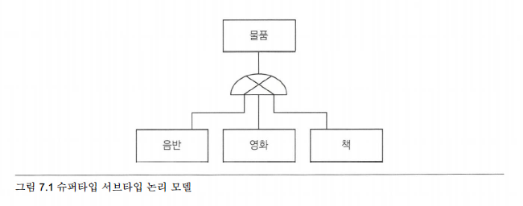
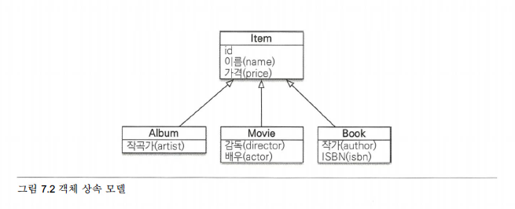
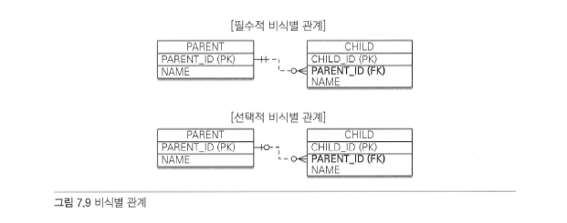
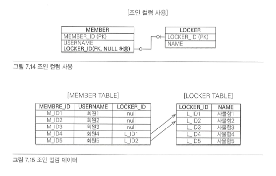
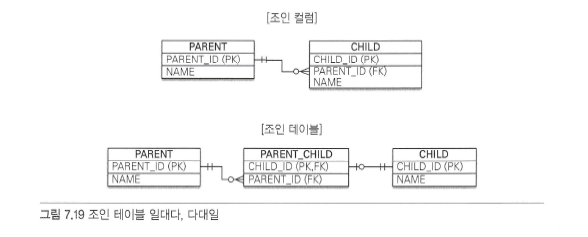
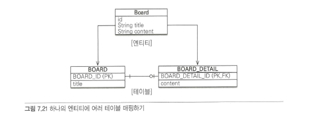

# 7장 고급 매핑

## 상속 관계 매핑

`ORM`에서 이야기하는 상속 관계 매핑은 `객체의 상속 구조`와 데이터베이스의 `슈퍼타입` `서브타입` 관계를 매핑하는 것이다.



슈퍼타입, 서브타입 `논리 모델`을 `물리 모델` 구현 방법

* **각각의 테이블로 변환** : `슈퍼타입`, `서브타입` 테이블을 각각 생성하여 조회할 때 조인을 사용한다.
* **통합 테이블로 변환** : 테이블을 하나만 사용해서 통합한다. \(`단일 테이블 전략`\)
* **서브타입 테이블로 변환** : 서브 타입마다 하나의 테이블을 만든다. \(`구현 클래스 테이블 전략`\)

### 조인 전략

* 자식 테이블이 부모 테이블의 기본 키를 받아서 `기본 키` + `외래 키`로 사용하는 전략
* **주의할 점은 타입을 구분하는 컬럼을 추가해야 한다.** 여기서는 `DTYPE` 컬럼을 구분 컬럼으로 사용



```java
@Entity
@Inheritance(strategy = InheritanceType.JOINED) // 상속 매핑은 부모 클래스에 선언해야 한다. 
@DiscriminatorColumn(name = "DTYPE") // 부모 클래스에 구분 컬럼을 지정한다. 
public abstract class Item {

	@Id @GeneratedValue
	@Column(name = "ITEM_ID")
	private Long id;

	private String name; //이름
	private int price; //가격
	...
}

@Entity
@DiscriminatorValue("A") // 엔티티를 저장할 때 구분 컬럼에 입력할 값을 지정한다. 
public class Album extends Item {
  private String artist;
	...
}

@Entity
@DiscriminatorValue("M")
@PrimaryKeyJoinColumn(name = "MOVIE_ID") // 자식 테이블의 기본 키 컬럼명을 변경 (기본 값은 부모 테이블의 ID 컬럼명)
public class Movie extends Item {
  private String director; //감독
  private String actor; //배우
	...
}
```

#### 장점

* 테이블이 `정규화`된다.
* `외래 키 참조 무결성` 제약 조건을 활용할 수 있다.
* `저장공간`을 효율적으로 사용한다.

#### 단점

* 조회할 때 `조인`이 많이 사용되므로 `성능이 저하`될 수 있다.
* 조회 쿼리가 복잡하다
* 데이터를 등록할 `INSERT SQL`을 두 번 실행한다.

#### 특징

* JPA 표준 명세는 구분 컬럼을 사용하도록 하지만 `하이버네이트`를 포함한 몇몇 구현체는 구분 컬럼\(`@DiscriminatorColumn`\) 없이도 동작한다.

### 단일 테이블 전략

이름 그대로 테이블을 하나만 사용한다. 그리고 구분 컬럼\(`DTYPE`\)으로 어떤 자식 데이터가 저장되었는지 구분한다. **조회할 때 조인을 사용하지 않으므로 일반적으로 가장 빠르다.** 이 전략을 사용할 때 주의점은 `자식 엔티티`가 매핑한 `컬럼`은 모두 `null`을 허용해야 한다.


```java
@Entity
@Inheritance(strategy = InheritanceType.SINGLE_TABLE)
@DiscriminatorColumn(name = "DTYPE") 
public abstract class Item {

	@Id @GeneratedValue
	@Column(name = "ITEM_ID")
	private Long id;

	private String name; //이름
	private int price; //가격
	...
}

@Entity
@DiscriminatorValue("A") 
public class Album extends Item {
	...
}

@Entity
@DiscriminatorValue("M") 
public class Movie extends Item {
	...
}
```

#### 장점

* 조인이 필요 없으므로 일반적으로 `조회 성능`이 빠르다
* `조회 쿼리`가 단순하다

#### 단점

* 자식 엔티티가 매핑한 컬럼은 모두 `null`을 허용해야 한다.
* `단일 테이블`에 모든 것을 저장하므로 테이블이 커질 수 있다. \(**성능이 더 안좋아 질 수 있음**\)

#### 특징

* `구분 컬럼`을 꼭 사용해야 한다. \(**지정하지 않으면 기본으로 엔티티 이름을 사용한다**\)

### 구현 클래스마다 테이블 전략

구현 클래스마다 테이블 전략은 `자식 엔티티`마다 테이블을 만든다. 그리고 자식 테이블 각각에 필요한 컬럼이 모두 있다. **일반적으로 추천하지 않는 전략이다.**


```java
@Entity
@Inheritance(strategy = InheritanceType.TABLE_PER_CLASS)
public abstract class Item {

	@Id @GeneratedValue
	@Column(name = "ITEM_ID")
	private Long id;

	private String name; //이름
	private int price; //가격
	...
}
```

#### 장점

* `서브 타입`을 구분해서 처리할 때 효과적이다.
* `not null 제약조건`을 사용할 수 있다.

#### 단점

* 여러 자식 테이블을 함께 조회할 때 성능이 느리다. \(`SQL`에 `UNION`을 사용해야 한다\)
* 자식 테이블을 통합해서 쿼리하기 어렵다

#### 특징

* 구분 컬럼을 사용하지 않는다.

## @MappedSuperclass

부모 클래스는 테이블과 매핑하지 않고 부모 클래스를 상속 받는 자식 클래스에게 매핑 정보만 제공하고 싶으면 `@MappedSuperclass`를 사용하면 된다. `@MappedSuperclass`는 실제 테이블과는 매핑되지 않는다. 이것은 단순히 매핑 정보를 `상속할 목적`으로만 사용된다.


```java
@MappedSuperclass
public abstract class BaseEntity {
  @Id @GeneratedValue
  private Long id;
  private String name;
  ...
}

@Entity
public class Member extends BaseEntity {

  //ID 상속
  //NAME 상속

  private String email;
  ...
}

@Entity
public class Seller extends BaseEntity {

  //ID 상속
  //NAME 상속

  private String shopName;
  ...
}
```

부모로부터 물려받은 매핑 정보를 재정의하려면 `@AttributeOverrides`나 `@AttributeOverride`를 사용하고, 연관관계를 재정의하려면 `@AssociationOverrides`나 `@AssociationOverride`를 사용한다.

#### 특징

* **테이블과 매핑 되지 않고 자식 클래스에 엔티티의 매핑 정보를 상속하기 위해 사용한다.**
* `@MappedSuperclass`로 지정한 클래스는 엔티티가 아니므로 `em.find()`나 `JPQL`에서 사용할 수 없다.
* 이 클래스를 직접 생성해서 사용할 일은 거의 없으므로 `추상 클래스`로 만드는 것을 `권장`한다.

## 복합 키와 식별 관계 매핑

### 식별 관계

식별 관계는 부모 테이블의 기본 키를 내려받아서 자식 테이블의 `기본 키` + `외래 키`로 사용하는 관계다.


### 비식별 관계

비식별 관계는 `부모 테이블`의 `기본 키`를 받아서 `자식 테이블`의 `외래 키`로만 사용하는 관계다.



* 필수적 비식별 관계\(`Mandatory`\): 외래 키에 NULL을 허용하지 않는다.
* 선택적 비식별 관계\(`Optional`\): 외래 키에 NULL을 허용한다. \(**대부분은 비식별 관계로 유지한다**\)

### 복합 키

JPA는 복합 키를 지원하기 위해 `@IdClass`와 `@EmbeddedId` 2가지 방법을 제공하는데 `@IdClass`는 관계형 데이터베이스에 가까운 방법이고 `@EmbeddedId`는 좀 더 객체지향에 가까운 방법이다.

#### @IdClass

복합 키 테이블은 비식별 관계고 `PARENT`는 복합 기본 키를 사용한다. **\(객체의 상속과는 무관하다\)**


```java
@Entity
@IdClass(ParentId.class)
public class Parent {
  @Id
  @Column(name = "PARENT_ID1")
  private String id1; //Parentld.id1과연결

  @Id
  @Column(name = "PARENT_ID2")
  private String id2; //Parentld.id2와연결
  
  private String name;
  ...
}
```

```java
public class ParentId implements Serializable {
  private String id1; //Parent.id1 매핑
  private String id2; //Parent.id2 매핑

  public ParentId() { }

  public ParentId(String id1, String id2) {
    this.id1 = id1;
    this.id2 = id2;
  }

  @Override
  public boolean equals(Object o) {...}
  @Override
  public int hashCode() {. ..}
}
```

```java
Parent parent = new Parent();
parent.setldl ("myId1"); //식별자
parent.setld2 ("myld2"); //식별자
parent.setName("parentName");
em.persist(parent);
```

#### 자식 클래스를 추가해보자

```java
@Entity
public class Child {
  @Id
  private String id;

  @ManyToOne
  @JoinColumns({
    @JoinColumn(name = ”PARENT_ID1”,
      referencedColumnName = "PARENT_ID1"),
    @JoinColumn(name = "PARENT_ID2",
      referencedColumnName = "PARENT_ID2")
  })
  private Parent parent;
  
  ...
}
```


#### @IdClass는 다음 조건을 만족해야 한다.

* 식별자 클래스의 속성명과 엔티티에서 사용하는 식별자의 속성명이 같아야 한다.  \(Parent.id1 → ParentId.id1, Parent.id2 → parentId.id2\)
* `Serializable` 인터페이스를 구현해야 한다.
* `equals`, `hashCode`를 구현해야 한다
* `기본 생성자`가 있어야 한다
* 식별자 클래스는 `public`이어야 한다


### @EmbeddedId

`@IdClass`가 데이터베이스에 맞춘 방법이라면 `@EmbeddedId`는 좀 더 객체지향적인 방법이다.

```java
@Entity
public class Parent {
  @EmbeddedId
  private ParentId id;
  private String name;
  ...
}
```

`@IdClass`와는 다르게 `@EmbeddedId`를 적용한 식별자 클래스는 `식별자 클래스`에 `기본 키`를 직접 매핑한다.

```java
@Embeddable
public class ParentId implements Serializable {
  @Column(name = "PARENT_ID1")
  private String id1;

  @Coluinn (name = "PARENT_ID2")
  private String id2;
  
  //equals and hashCode 구현
  ...
}
```


#### @EmbeddedId를 적용한 식별자 클래스는 다음 조건을 만족해야 한다

* `@Embeddable` 어노테이션을 붙여주어야 한다.
* `Serializable` 인터페이스를 구현해야 한다.
* `equals`, `hashCode`를 구현해야 한다.
* `기본 생성자`가 있어야 한다.
* 식별자 클래스는 `public`이어야 한다.


### 복합 키와 equals\(\), hashCode\(\)

복합 키는 quals\(\)와 hashCode\(\)를 필수로 구현해야 한다.

```java
ParentId id1 = new parentId() ;
id1.setld1("myId1”);
id1.setld2("myId2”);

ParentId id2 = new parentId();
id2.setId1("myId1");
id2.setId2("myId2");

id1.equals(id2) -> ???
```

`equals()`를 적절히 오버라이딩 했다면 참이겠지만 equals\(\)를 적절히 오버라이딩 하지 않았다면 결과는 **거짓**이다. 자바의 모든 클래스는 기본 `equals()`는 인스턴스 참조 값 비교인 **==** 비교\(`동일성 비교`\)를 하기 때문이다. 따라서 객체의 `동등성`\(equals 비교\)이 지켜지지 않으면 예상과 다른 엔티티가 조회되거나 엔티티를 찾을 수 없는 등 영속성 컨텍스트가 엔티티를 관리하는 데 심각한 문제가 발생한다.

#### @IdClass vs @EmbeddedId

`@EmbeddedId`가 `@IdClass`와 비교해서 더 객체지향적이고 중복도 없어서 좋아 보이긴 하지만 특정 상황에 `JPQL`이 조금 더 길어질 수 있다.

```java
em.createQuery("select p.id.id1, p.id.id2 from Parent p"); //@Embeddedld
em.createQuery("select p.id1, p.id2 from Parent p"); //@IdClass
```

### 복합 키: 식별 관계 매핑

식별 관계에서 자식 테이블은 부모 테이블의 기본 키를 포함해서 복합 키를 구성해야 하므로 `@IdClass`나 `@EmbeddedId`를 사용해서 식별자를 매핑해야 한다.


#### @IdClass와 식별 관계

```java
//부모
@Entity
public class Parent {
  @Id @Column(name = "PARENT_ID")
  private String id;
  private String name;
  ...
}

//자식
@Entity
@IdClass(ChildId.class)
public class Child {
  @Id
  @ManyToOne
  @JoinColumn(name = "PARENT_ID")
  public Parent parent;

  @Id @Column(name = "CHILD_ID")
  private String childId;

  private String name;
}

//자식 ID
public class ChildId implements Serializable {
  private String parent; //Child.parent 매핑
  private String childId; //Child.childId 매핑
  //equals, hashCode
}

//손자
@Entity
@IdClass(GrandChildld.class)
public class GrandChild {
  @Id
  @ManyToOne
  @JoinColumns({
    @JoinColunm(name = "PARENT_ID"),
    @JoinColumn(name = "CHILD_ID")
  })
  private Child child;

  @Id @Column(name = "GRANDCHILD_ID")
  private String id;
  private String name;
  ...
}

//손자 ID
public class GrandChildld implements Serializable {
  private ChildId child; //GrandChild.child 매핑
  private String id; //GrandChild.id 매핑

  //equals, hashCode
	...
}
```

#### @EmbeddedId와 식별 관계

@EmbeddedId로 식별 관계를 구성할 때는 @MapsId를 사용해야 한다.

```java
//부모
@Entity
public class Parent {
  @Id @Column(name = "PARENT_ID")
  private String id;

  private String name;
}

//자식
@Entity
public class Child {
  @EmbeddedId
  private ChildId id;

  @MapsId("parentId") //ChildId.parentId 매핑
  @ManyToOne
  @JoinColumn(name = "PARENT_ID")
  public Parent parent;

  private String name;
}

//자식 ID
@Embeddable
public class ChildId implements Serializable {
  private String parentId; //@MapsId("parentId")로매핑
  
  @Column(name = "CHILD_ID")
  private String id;

  //equals, hashCode
  ...
}

//손자
@Entity
public class GrandChild {
  @EmbeddedId
  private GrandChildId id;

  @MapsId("childId") //GrandChildId.childId 매핑
  @ManyToOne
  @JoinColumns({
    @JoinColumn(name = "PARENT_ID"),
    @JoinColumn(name = "CHILD_ID")
  })
  private Child child;

  private String name;
	...
}

//손자 ID
@Embeddable
public class GrandChildld implements Serializable {
  private Childld childld; //@MapsId(”childld")로 매핑
  @Column(name = "GRANDCHILD_ID")
  private String id;

  //equals, hashCode
  ... 
}
```

### 비식별 관계로 구현

```java
//부모
@Entity
public class Parent {
  @Id @GeneratedValue
  @Column(name = "PARENT_ID")
  private Long id;
  private String name;
  ...
}

//자식
@Entity
public class Child {
  @Id @GeneratedValue
  @Column(name = "CHILD_ID")
  private Long id;

  private String name;

  @ManyToOne
  @JoinColumn(name = "PARENT_ID")
  private Parent parent;
  
  ...
}

//손자
@Entity
public class Grandchild {
  @Id @GeneratedValue
  @Column(name = "GRANDCHILD_ID")
  private Long id;

  private String name;

  @ManyToOne
  @JoinColumn(name = "CHILD_ID")
  private Child child;

  ...
}
```

### 일대일 식별 관계

일대일 식별 관계는 자식 테이블의 기본 키 값으로 부모 테이블의 기본 키 값만 사용한다.


```java
//부모
@Entity
public class Board {
  @Id @GeneratedValue
  @Column(name = "BOARD_ID")
  private Long id;

  private String titie;

  @OneToOne(mappedBy = "board")
  private BoardDetail boardDetail;

  ...
}

//자식
@Entity
public class BoardDetail {
  @Id
  private Long boardId;

  @MapsId //BoardDetail.boardId 매핑
  @OneToOne
  @JoinColumn(name="BOARD_ID")
  private Board board;

  private String content;
  ...
}
```

### 식별, 비식별 관계의 장단점

#### 데이터베이스 설계 관점

* `식별 관계`는 부모 테이블의 기본 키를 자식 테이블로 `전파`하면서 자식 테이블의 기본 키 컬럼이 점점 늘어난다. 결국 조인할 때 `SQL`이 복잡해지고 `기본 키 인덱스`가 불필요하게 커질 수 있다.
* 비즈니스 요구사항은 시간이 지남에 따라 언젠가는 변한다. 식별 관계의 `자연 키 컬럼`들이 자식에 손자까지 전파되면 변경하기 힘들다
* 식별 관계는 `테이블 구조`가 유연하지 못하다.

#### 객체 관계 매핑 관점

* `JPA`에서 복합 키는 별도의 `복합 키 클래스`를 만들어서 사용해야 한다.
* `JPA`는 `@GenerateValue`처럼 대리 키를 생성하기 위한 편리한 방법을 제공한다. 그러나 식별 관계에서는 사용하기 힘들다.

#### 식별 관계가 가지는 장점도 있다.

* `기본 키 인덱스`를 활용하기 좋다.\(상위 테이블에서 정의해놓은 `인덱스`를 그대로 사용할 수 있다\)

## 조인 테이블

데이터베이스 테이블의 `연관관계`를 설계 방법은 크게 2가지가 있다.

* 조인 컬럼 사용\(`외래키`\)
* 조인 테이블 사용\(`테이블` 사용\)

### 조인 컬럼 사용



`선택적 비식별 관계`는 외래 키에 `null`을 허용 하므로 회원과 사물함을 조인할 때 외부 조인\(`OUTER JOIN`\)을 사용해야 한다. **실수로 내부 조인을 사용하면 사물함과 관계가 없는 회원은 조회되지 않는다.** 그리고 회원과 사물함이 아주 `가끔` 관계를 맺는다면 외래 키 값 대부분이 `null`로 저장되는 `단점`이 있다.

### 조인 테이블 사용


이 방법은 `조인 테이블`이라는 별도의 테이블을 사용해서 `연관관계`를 관리한다. 따라서 `MEMBER`와 `LOCKER`에는 연관관계를 관리하기 위한 `외래 키 컬럼`이 없다. 단점은 `조인 테이블`을 하나 추가해야 한다는 점이다.

조인 테이블은 주로 `다대다` 관계를 `일대다`, `다대일` 관계로 풀어내기 위해 사용한다.

### 일대일 조인 테이블

`일대일` 관계를 만들려면 `조인 테이블`의 외래 키 컬럼 각각에 총 2개의 유니크 `제약조건`을 걸어야 한다. \(`PARNET_ID`는 기본 키이므로 `유니크 제약조건`이 걸려 있다\)

```java
//부모
@Entity
public class Parent {
  @Id @GeneratedValue
  @Column(name = "PARENT_ID")
  private Long id;

  private String name;
  
  @OneToOne
  @JoinTable(name = "PARENT_CHILD",
    joinColumns = @JoinColumn(name = "PARENT_ID"),
    inverseJoinColumns = @JoinColumn(name = "CHILD_ID")
  )
  private Child child;
  ...
}

//자식
@Entity
public class ChiId {
  @Id @GeneratedValue
  @Column(name = "CHILD_ID")
  private Long id;

  private String name;
  ...
}
```

### 일대다 조인 테이블

`일대다` 관계를 만들려면 조인 테이블의 컬럼 중 다와 관련된 컬럼인 `CHILD_ID`에 유니크 제약조건을 걸어야 한다.



### 다대일 조인 테이블

다대일은 일대다에서 방향만 반대이다

```java
//부모
@Entity
public class Parent {
  @Id @GeneratedValue
  @Column(name = "PARENT_ID")
  private Long id;

  private String name;
  
  @OneToMany(mappedBy = "parent")
  private List<Child> child = new ArrayList<Child>();
}

//자식
@Entity
public class Child {
  @Id @GeneratedValue
  @Column(name = ”CHILD_ID")
  private Long id;

  private String name;
  @ManyToOne(optional = false)
  @JoinTable(name = HPARENT_CHILD",
    joinColumns = @JoinColumn(name = "CHILD_ID"),
    inverseJoinColumns = @JoinColumn(name = "PARENT_ID")
  )
  private Parent parent;
}
```

### 다대다 조인 테이블

다대다 관계를 만들려면 조인 테이블의 두 컬럼을 합해서 하나의 복합 유니크 제약조건을 걸어야 한다


```java
//부모
@Entity
public class Parent {
  @Id @GeneratedValue
  @Column(name = "PARENT_ID")
  private Long id;
  private String name;

  @ManyToMany
  @JoinTable(name = "PARENT_CHILD",
    joinColumns = @JoinColumn(name = "PARENT_ID"》,
    inverseJoinColumns = @JoinColumn(name = "CHILD_ID")
  )
  private List<Child> child = new ArrayList<Child〉();
}

//자식
@Entity
public class Child {
  @Id @GeneratedValue
  @Column(name = "CHILD_ID")
  private Long id;
  private String name;
}
```

조인 테이블에 컬럼을 추가하면 @JoinTable 전략을 사용할 수 없다. 대신에 새로운 엔티티를 만들어서 조인 테이블과 매핑해야 한다.

### 엔티티 하나에 여러 테이블 매핑

잘 사용하지는 않지만 `@SecondaryTable`을 사용하면 한 엔티티에 여러 테이블을 매핑할 수 있다.



```java
@Entity
@Table(name="BOARD")
@SecondaryTable (name = "BOARD_DETAIL" ,
  pkJoinColumns = SPrimaryKeyJoinColumn (name = "BOARD_DETAIL_ID"))
public class Board {
  @Id @GeneratedValue
  @Column(name = "BOARD_ID")
  private Long id;

  private String title;

  @Column(table = "BOARD_DETAIL")
  private String content;

  ...
}
```

`@SecondaryTable` 속성은 다음과 같다.

* @SecondaryTable.name : 매핑할 다음 테이블 이름
* @SecondaryTable.pkJoinColumns : 매핑할 다른 테이블의 기본 키 컬럼 속성

참고로 `@SecondaryTable`을 사용해서 두 테이블을 하나의 엔티티에 매핑하는 방법보다는 테이블당 엔티티를 각각 만들어서 `일대일 매핑`하는 것을 권장한다. **이 방법은 항상 두 테이블을 조회하므로 최적화하기 어렵다.**


