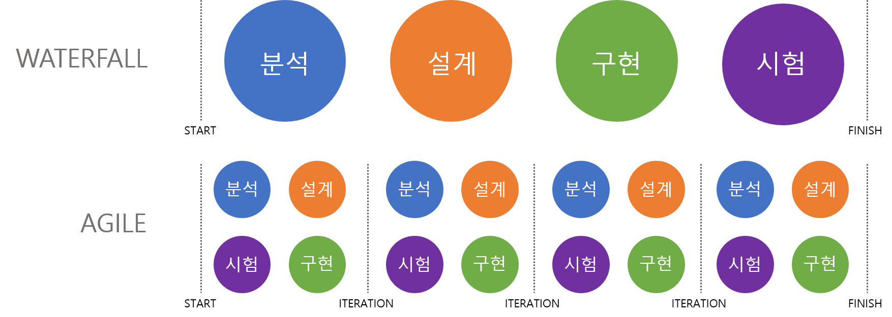
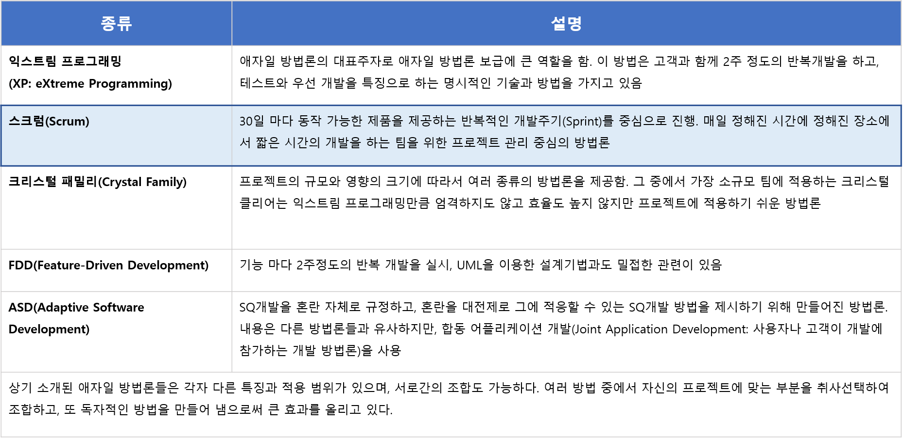

# What is Agile??

## 소프트웨어 개발 방법론?

소프트웨어 공학원리를 소프트웨어 개발 생명주기에 적용한 개념으로 정보시스템을 개발하기 위한 작업활동, 절차, 산출물 기법 등을 체계적으로 정리한 개념

## Waterfall vs Agile

Waterfall : 소프트웨어 개발을 단계적, 순차적으로 수행되는 절차적 프로그래밍 기법이다. \(Top-Down방식\) Agile : 프로젝트 개발 대상을 작은 기능으로 분할하여 하나의 기능을 하나의 반복 주기 내에 개발하는 개발 방법

### 장단점 분석

### Agile 종류

## Scrum Process

* 스크럼 개발 과정은 업무 환경이나 리드하는 사람에 따라서 상이할 수 있다. 

### Step 1. Product Backlog

스크럼을 시작하는 단계로써 사전에 프로젝트의 기능정의 문서나 스토리보드등 기본적으로 개발을 진행하기 이전에 필요한 문서 작업이 완료되었다는 전제하에 PO는 스크럼에 해당하는 백로그를 등록한다. 하나의 스크럼에 대한 백로그만 등록할 수 도 있지만 스크럼을 여러개 등록하여 각 스크럼의 백로그를 등록할 수도 있다.

### Step 2. Sprint Backlog

PO가 등록한 백로그를 기준으로 스크럼 참여자들은 본인이 수행해야할 백로그의 서브 테스크를 등록한다.   
 서브 테스크를 등록하는 단계에서는 상호간에 협의가 필요한 부분이나 협업해야 하는 부분에 대해서 충분히 검토가 되어야 하고 반영되어야 한다.

### Step 3. Scrum Meeting

스프린트가 시작되면 최소 1주일에서 최대 4주 정도로 진행된다. \(기간을 산정하는건 task의 m/m 선정을 기준으로 산정한다.\) 데일리로 스크럼 미팅을 진행하며 이슈가 있거나 협의가 필요한 내용을 공유 한다. 스크럼 미팅은 될수 있는 한 짧고 간결하게 하는게 원칙이며 어느 프로젝트에서는 스탠드 미팅으로 진행하기도 한다. 또한, 스크럼 미팅에서 공유해야할 내용이 없을 경우에는 생략하는 프로젝트 팀도 있다.

### Step 4. QA

프로젝트의 특성에 따라 QA단계를 스크럼 단계에서 진행하기도 하지만 별도로 QA기간을 지정하여 진행하는 경우도 있다. 해당 단계는 스프린트가 완료되고 QA를 진행하는 단계이다.

### Step 5. Sprint review

QA단계 까지 완료되면 스프린트에 참여하였던 인원들은 초기에 PO가 작성해준 백로그를 기반으로 데모를 시연하고 스크럼 미팅에서 이슈된 내용을 정리하여 다음 스프린트에서 반영될 부분들을 확인하게 된다.

### Step 6. Sprint Retrospective

스프린트가 완료된 시점으로 참여자들은 PO가 작성한 질문지를 통해서 이번 스프린트에 대한 회고를 작성한다. 회고에 대한 내용은 추후 스프린트에 대한 방향성이나 보완할 수 있는 부분으로 사용되어진다. 그러므로 질문지를 얼마나 효과적으로 작성하는지도 매우 중요하다.

## PROS AND CONST

### 장점

* 진행 업무에 대한 가시성이 높다. 
* 전반적으로 모두가 참여적으로 업무를 진행하다 보니 성취감이나 목적성이 분명해진다.
* 빠른 시일 내에 결과물을 확인 할 수 있다. 
* 정책에 대한 결정이나 피드백이 많이 필요한 프로젝트에서는 스크럼 미팅을 통해 빠른 피드백을 받아 볼수 있다. \(데일리 미팅에서 이슈를 공유해야하는 반 강제성\)
* 개발 기간 동안에는 불필요한 산출물 작업 시간을 줄이고 업무에 집중할 수 있는 시간을 증가 시켜준다. 

### 단점

* 실무진은 결과물에 대한 압박이나 다소 부담감을 가질 수 있다. \(기획이나 디자인 영역에서는 다소 부담감이 심할 수 있다.\)
* 스프린트 참여자 중에 커뮤니케이션이 잘 되지 않는 멤버가 있다면 모두가 참여하는 스프린트 개발 환경에서는 퍼포먼스에서 오히려 역 효과가 나타날 수 있다. 
* 스프린트를 하는 동안에는 산출물을 만들지 않는 부분이 장점이 될 수 있지만 프로젝트가 종료되는 시점에는 산출물이 필요하므로 별도로 시간을 투자해야 하는 단점이 있다. 
* 서브 테스트의 일정 산정하는 부분에는 개별 역량에 대한 고려가 없이 통계적으로 계산하다 보니 잘못된 집단 지성이 집계됨
* 프로젝트를 진행하는 인력이 부족할 경우에는 PO나 SM의 역활을 병행하며 업무에도 참여하기에는 다소 힘든 부분이 있다. \(업무를 조율하고 이슈를 해결하는데 생각보다 많은 시간이 소요 된다.\)
* 백로그 단위로 스프린트를 통해서 프로젝트를 진행하다보니 전체적인 스케줄을 체크하거나 전체 일정을 관리할 수 있는 부분이 부족하다. 

## Reference URL

* [http://blog.rightbrain.co.kr/?p=5810](http://blog.rightbrain.co.kr/?p=5810)
* [http://www.moreagile.net/2014/03/misunderstandsofagiledevelopment.html](http://www.moreagile.net/2014/03/misunderstandsofagiledevelopment.html)
* [https://okky.kr/article/313231](https://okky.kr/article/313231)
* [http://wonnyz.tumblr.com/post/136256619316/%EC%99%9C-%EC%95%A0%EC%9E%90%EC%9D%BC-%ED%8A%B9%ED%9E%88-%EC%8A%A4%ED%81%AC%EB%9F%BC%EC%9D%B4-%EB%81%94%EC%B0%8D%ED%95%9C%EA%B0%80](http://wonnyz.tumblr.com/post/136256619316/%EC%99%9C-%EC%95%A0%EC%9E%90%EC%9D%BC-%ED%8A%B9%ED%9E%88-%EC%8A%A4%ED%81%AC%EB%9F%BC%EC%9D%B4-%EB%81%94%EC%B0%8D%ED%95%9C%EA%B0%80)

