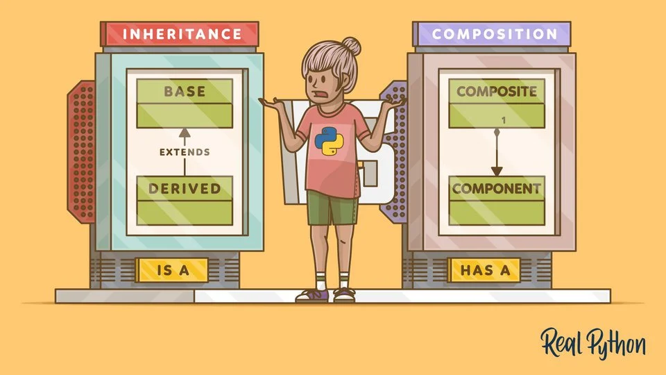

# 상속보단 합성



## 상속이란?

상속은 자식 클래스가 부모 클래스를 상속받아 설계된 구조를 일컫는다. 상속으로 이루어진 관계에서는 부모 클래스의 멤버 변수나 메소드를 사용할 수 있다.

```java
public class Animal {
    ...
}

public class Bird extends Animal {
    ...
}
```

### 자식 클래스는 부모 클래스의 모든 접근이 가능한가?

모두 접근 가능한 것은 아니다. 부모 클래스의 멤버 변수나 메소드의 접근자가 private이 아닌 public 이나 protected일 경우에만 사용할 수 있다. default 접근자는 패키지 구조에 따라 접근할 수 있거나 없다.

### protected 접근자는 왜 사용할까?

#### 우선, public과 protected의 차이를 살펴 보자.

* public 접근자는 외부에 노출이 가능하다.
* public 접근자는 자식 클래스가 접근할 수 있다.
* protected 접근자는 외부에는 노출 되지는 않는다.
* protected 접근자는 자식 클래스가 접근할 수 있다.

결론은, 두 접근자 모두 자식 클래스에게 노출이 되지만 외부에 노출 여부가 차이가 있다.

#### 외부로 노출하고 싶지 않고 자식 클래스에 노출하고 싶은 경우는?

protected를 사용하는 이유는 두 가지로 나열할 수 있다.

* 상속받은 자식 클래스의 특성에 따라 변경 가능성이 열려 있다는 것을 암시한다.
* 미 구현 되었으므로 상속받은 자식 클래스에서 구현을 완성시켜야 한다는 것이다.

public 접근자는 외부로 노출되어 있기 때문에 이미 구현이 완성이 되었다는 것을 의미한다.

예제를 통해서 protected를 사용하는 경우를 살펴보자. 이전의 예로 들었던 Animal과 Bird를 다시 살펴보자. Animal의 move 메소드는 이동한다는 행동을 표현한 것이고 일반적인 동물은 이동할 경우에 걸어서 이동한다는 일반적인 경우를 메소드로 정의하였다. 그러나 자식 클래스인 Bird는 움직일 경우 날개를 이용하여 하늘을 날아서 이동한다.

> 그러므로 같은 이동한다는 의미가 상속받은 자식클래스에 따라서 변한다는 것을 알 수 있다.

그렇다면 move는 protected가 더 명확할 수 있겠다. 접근자를 변경하였으니 외부에 노출될 수 있는 go 메소드를 추가하겠다.

```java
public class Animal {
    private int legCount;
    private String name;

    public void printName(){
        System.out.println("I'm " + this.name);
    }

    private void run(){
        System.out.println("run with legs");
    }

    protected void move(){
        this.run();
    }

    public void go(){
        this.move();
    }
}

public class Bird extends Animal {
    private int wingCount;

    public void printName(){
        super.printName();
        System.out.println("I have ${wingCount} wings");
    }
    private void fly() {
        System.out.println("fly with wings");
    }

    protected void move(){
        this.fly();
    }

    public static void main(String[] args) {
        Bird bird = new Bird();
        bird.printName();
    }
}
```

### 상속은 언제 사용해야 할까?

상속을 사용해야 하는 명확한 이유는 SOLID 원칙에서 제시해주고 있다. SOLID 원칙의 Liskov Subsustitution Principle을 통해서 해답을 얻을 수 있다. 리스코프 치환 원칙은 상속받은 자식 클래스는 부모 클래스를 대체할 수 있는 경우에만 상속을 해야 한다고 명시하고 있다.

자식 클래스가 부모 클래스를 대체 할 수 있는 경우는 부모 클래스의 외부로 노출되는 메소드를 자식 클래스에서도 같은 의미로 제공되어야 한다는 것을 의미한다. 그렇기 때문에 우리가 많이 들어보았던 'IS-A' 관계가 성립해야 할 수 있다는 것을 알 수 있다.

### 상속으로 얻을 수 있는 장점은 무엇이 있을까?

상속 관계에서는 외부로부터 다형성을 보장하면서 클래스 내부 구현 코드를 모두 구현하지 않고 공통된 로직을 그대로 사용할 수 있고, 클래스 타입에 따라 변경되는 로직만 일부분 구현하면 된다는 것이 장점이 될 수 있다. 하지만 이런 장점도 Java 8부터는 인터페이스의 디폴트 메소드 기능이 나오면서 인터페이스내에서 로직 구현이 가능하여 상속의 장점이 약화되었다고 할 수 있다. 그래서 더 상속보다는 인터페이스를 사용해야 한다는 주장이 힘이 실리는 것 같다고 생각한다.

### 그럼 추상 클래스는 왜 사용하지?

추상 클래스는 protected 접근자를 사용하는 이유를 더 명확하게 나타내기 위해서 사용한다고 할 수 있다. 부모 클래스에서는 변경되는 로직을 abstract로 정의하여 내부 로직은 구현하지 않고 상속받은 자식 클래스에서는 무조건 구현할 수 있게 만들어 변경되어야 할 부분과 변경되지 않을 부분을 더 명확하게 구분할 수 있게 되었다. 또한, 컴파일 단계에서 자식클래스가 abstrct 메소드를 오버라이드 하지 않을 경우에는 에러가 발생하므로 런타임단계에서 발생할 수 있는 예외를 명확하게 확인할 수 있는 장점이 있다.

이런 추상 클래스를 사용한 대표적인 사례가 템플릿 메소드 패턴이라고 할 수 있다. 템플릿 메소드 패턴은 외부로 노출되는 메소드는 그대로이나 내부에서 변경되는 로직만 별도로 추상화하여 외부에서 필요한 전략을 선택하여 내부 구현만 변경되도록 노출하는 디자인 패턴이다.

아래는 오브젝트책에서 발췌한 내용으로 상품 할인이라는 부모 클래스를 두고 public 메소드는 calculateDiscountAmount\(\)를 사용하지만 메소드 내부에선 할인 정책을 추상화하여 상속받은 자식 클래스에게 할인 정책에 대한 계산을 위임하는 것을 확인 할 수 있다.

```java
public abstract class DiscountPolicy {
    private List<DiscountCondition> conditions = new ArrayList<>();

    public DiscountPolicy(DiscountCondition ... conditions) {
        this.conditions = Arrays.asList(conditions);
    }

    public Monet calculateDiscountAmount(Screening screening) {
        for(DiscountCondition each : conditions) {
            if (each.isSatisfiedBy(screening)) {
                return getDiscountAmount(screening);
            }
        }
        return Money.ZERO;
    }

    abstract protected Money getDiscountAmount(Screeing screening);
}
```

## 잘못된 상속 방법은?

간혹 어떤 이는 상속은 코드를 재사용 하기 위해 사용한다고 주장하는 이도 있다. 이는 전형적인 상속의 잘못된 사용 사례이고 이는 추후에 커다란 오류를 범할 수 있다.

> 그렇다면 코드 재사용을 위해 상속을 하면 어떤 단점이 있을까?

### 캡슐화를 위반할 수 있다.

부모의 public 메소드는 외부에 노출하기 위한 용도로 사용된다. 그러나 자식 클래스에서도 부모 클래스의 public 메소드는 외부로 노출되기 때문에 자식 클래스에서 의도하지 않는 동작을 수반할 수 있게 되며 이는 캡슐화를 위반하게 되는 것이다. 다음은 전형적인 캡슐화 위반 사례를 볼 수 있다.

Stack 클래스는 Vector 클래스를 상속받는다. 그래서 Stack 클래스가 제공하는 push, pop 이지만 Vector 클래스의 add 메소드 또한 외부로 노출되게 된다. 그러면서 아래와 같이 의도치 않은 동작이 실행되면서 오류를 범하게 된다.

```java
Stack<String> stack = new Stack<>();
stack.push("1st");
stack.push("2nd");
stack.push("3rd");

stack.add(0, "4th");

assertEquals("4th", stack.pop()); // 실패!!!!
```

테스트 코드 결과가 실패가 되는 이유는 stack은 LIFO\(Last Input First Out\) 구조로 가장 나중에 추가된 엘리먼트가 pop\(\) 메소드를 실행할 경우에 리턴되어야 한다. 그러나 add 메소드를 호출함으로써 stack의 의미와는 다르게 특정 인덱스의 값이 추가가 되므로 테스트 결과값이 일치하지 않아서 테스트 실패 결과를 도출하게 되었다.

### 설계가 유연하지 않는다.

상속으로 인해 결합도가 높아지면 다음과 같은 두 가지 문제점이 발생한다.

* 하나의 기능을 추가하거나 수정하기 위해 불필요하게 많은 수의 클래스를 추가하거나 수정해야 한다.
* 단일 상속만 지원하는 언어에서는 상속으로 인해 오히려 중복 코드의 양이 늘어날 수 있다.


이처럼 상속의 남용으로 하나의 기능을 추가하기 위해 필요 이상으로 많은 수의 클래스를 추가해야 하는 경우를 가리켜 `클래스 폭발(class explosion)` 문제 또는 `조합의 폭발(combinational explosion)` 문제라고 부른다.

상속 관계는 `컴파일 타임`에 결정되고 고정되기 때문에 코드를 실행하는 도중에는 변경할 수 없다. 따라서 여러 기능을 조합해야 하는 설계에 상속을 이용하면 모든 조합 가능한 경우 별로 클래스를 추가 해야 한다.

