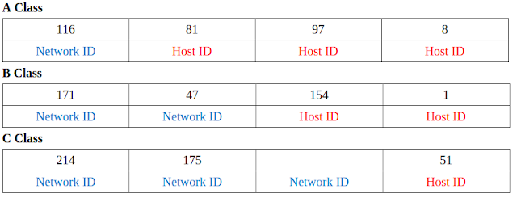

# DNS 동작 원리

## DNS는 무엇인가?

IP 네트워크에서 사용하는 시스템이다. 우리가 인터넷을 편리하게 쓰게 해주는 것으로, 영문/한글 주소를 IP 네트워크에서 찾아갈 수 있는 IP로 변환해 준다. DNS는 도메인 이름과 IP 주소를 서로 변환하는 역할을 한다.

### 그렇다면 IP 주소는 무엇인가?

IP주소는 네트워킹이 가능한 장비를 식별하는 주소를 가리킨다. IP주소는 네트워크 주소와 호스트 주소를 조합한 주소 체계를 가지고 있다.

* 네트워크 주소 : IP 기기가 속해 있는 네트워크를 구분
* 호스트 주소 : 네트워크 안에 있는 IP 기기를 구분

이런 주소 체계를 표현하는 방법은 IPv4와 IPv6로 표현할 수 있다.

### IPv4

IPv4 주소는 \(.\)마침표로 구분되며 4개의 8비트 필드로 구분된 십진수로 작성된다. 각 영역은 256가지의 경우의 수를 가질 수 있으므로 2의 8승을 표현할 수 있다. 이를 비트로 표현하면 영역마다 8비트로 이루어지며 총 4개의 영역으로 구분되므로 32비트를 사용한다.

하지만 기술이 급속도로 발전하면서 단말기의 갯수도 기하급수적으로 증가하다 보니 40억개에 달하는 IP주소의 수가 부족하게 되어 IPv6라는 확장된 주소 체계가 등장하게 되었다.

### IPv6

IPv6주소는 128비트체계로 구성 되어 있으며, 그 표현 방법은 128비트를 16비트씩 8부분으로 나누어지며, 각 구분은 16진수로 표현한다. 128비트 주소체계를 사용하게 되면 최대 1조개 이상의 주소를 가질 수 있는게 장점이다. 또한 IPv4에서 사용하는 클래스 계층 구조를 사용하지 않고 유니캐스트, 멀티캐스트, 멀티 캐스트 형태의 유형으로 할당하기 때문에 할당된 주소의 낭비 요인이 사라지게 된다.

#### IPv4에서 사용하는 클래스 계층 구조란 무엇인가?

네트워크 ID와 호스트 ID의 조합에 대한 규칙을 클래스로 표현하고 있다.

## DNS 동작 원리

1. 사용자는 브라우저에 "[www.example.com](http://www.example.com)"을 입력한다.
2. 로컬 host 파일을 검색한다. 이를 로컬 DNS 서버로 일컫는다.
3. 해당 파일에 IP 정보가 있을 경우, host 파일의 IP 정보를 전달한다.
4. 파일에 없을 경우, Root DNS 서버에 질의를 전송한다.
   * 로컬 DNS 서버는 Root DNS 서버 정보를 가지고 있어야 한다.
   * Root DNS 서버는 전세계에 13대 구축되어 있다. 우리나라의 경우 Root DNS 서버가 구축되어 있지는 않지만 Root DNS 서버에 대한 미러 서버를 3대 운용하고 있다.
5. Root DNS 서버는 요청한 도메인 이름에 해당하는 IP 주소가 있으면 전달한다
6. IP 주소가 존재하지 않는다면 다른 Root DNS 서버에게 질의하라고 응답한다. \(이를 재귀적 질의라 한다\)
7. 재귀적 질의를 반복하여 IP 주소 정보를 확인하면 확인된 IP 주소 정보는 로컬 DNS 서버에서 캐싱처리 한다.

## 참고

* [https://namu.wiki/w/DNS](https://namu.wiki/w/DNS)
* [https://zzsza.github.io/development/2018/04/16/domain-name-system/](https://zzsza.github.io/development/2018/04/16/domain-name-system/)
* [https://m.blog.naver.com/PostView.nhn?blogId=shj1126zzang&logNo=90193677759&proxyReferer=https:%2F%2Fwww.google.com%2F](https://m.blog.naver.com/PostView.nhn?blogId=shj1126zzang&logNo=90193677759&proxyReferer=https:%2F%2Fwww.google.com%2F)
* [https://ykarma1996.tistory.com/14](https://ykarma1996.tistory.com/14)
* [https://jwprogramming.tistory.com/28](https://jwprogramming.tistory.com/28)
* [http://korean-daeddo.blogspot.com/2015/12/ip.html](http://korean-daeddo.blogspot.com/2015/12/ip.html)

