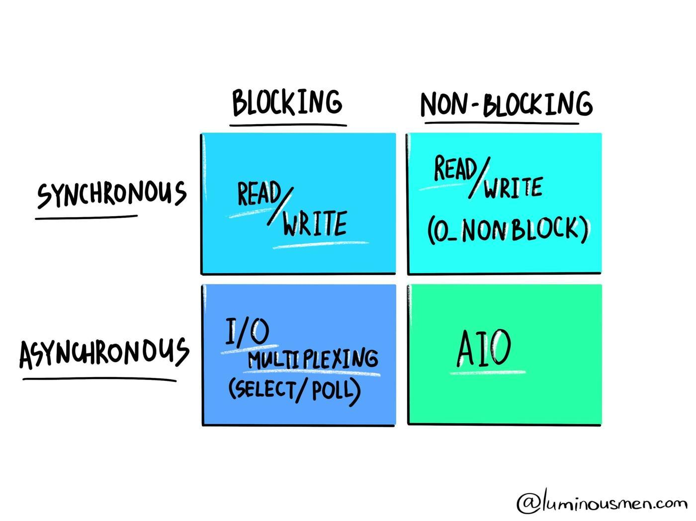

# 블럭킹 \| 논블럭킹 \| 동기 \| 비동기



## BLOCKING vs NON BLOCKING

블럭킹과 논블럭킹은 **`대기큐`**와 **`호출 결과 시점`**으로 구분할 수 있다. 설명하기 쉽게 프로그램 A와 B가 있다고 가정하겠다. 프로세스는 프로그램 A에서 B를 호출하는 순서로 진행한다.

### Blocking

* 프로그램 A 에서는 프로그램 B 로직이 수행 완료될 때 까지 대기큐에 들어가 로직이 완료된 이후에나 대기큐에서 프로그램 A가 반환되어 이후 로직을 수행할 수 있다.
* 프로그램 B는 호출 결과를 로직 수행 완료 이후에 프로그램 A에게 돌려주게 된다.

### Non Blocking

* 프로그램 A는 프로그램 B를 호출한 이후에도 제어권을 가지고 있어 대기큐에 들어가지 않고 다른 로직을 수행할 수 있다.
* 프로그램 B가 호출된 순간 호출되었다는 결과만 프로그램 A에게 돌려준다. 

## SYNC vs ASYNC

동기와 비동기는 호출한 결과의 **`완료 여부를 확인 하는가`**에 따라 구분할 수 있다. 이번에도 이전과 동일하게 프로그램 A,B로 가정하겠다. 프로세스도 동일하다.

### Sync

* 프로그램 B가 완료할 때까지 프로그램 A는 기다리게 되므로 아무런 로직도 수행하지 못한다.

### ASync

* 프로그램 B를 호출한 이후에 프로그램 A는 프로그램 B의 완료 여부를 기다리지 않고 다음 로직을 수행한다.

## 블럭킹 & 동기


* 애플리케이션에서 커널로 작업을 요청한다.
* 커널은 요청 받은 작업을 수행한다.
* 애플리케이션은 커널 작업이 완료될 때까지 대기한다.
* 커널의 작업이 완료되면 결과값을 리턴해준다.
* 애플리케이션은 커널의 결과를 확인하고 이후 로직을 수행한다.


**어느 경우에 볼 수 있을까?**  
  
일반적인 Spring MVC 방식에서는 대부분 블럭킹, 동기 방식으로 동작한다.


## 블럭킹 & 비동기


* 애플리케이션은 커널에 작업을 요청한다.
* 커널은 작업을 수행한다.
* 커널 작업 중간에 애플리케이션에 제어권을 넘겨 준다.
* 애플리케이션은 제어권을 위임 받았으므로 나머지 작업을 수행한다.
* 애플리케이션은 작업 중간에 커널에 작업 제어권을 다시 넘겨준다.
* 서로 제어권을 번갈아 수행하며 작업을 완료한다.


**어느 경우에 볼 수 있을까?**  
  
보통은 확인하기 힘든 케이스로 Node.js와 Mysql을 사용하면 확인할 수 있는 케이스가 있다. Node.js는 논블럭킹 비동기 방식으로 동작하고 Mysql은 블럭킹 방식으로 동작하기 때문에 Node.js 언어로 Mysql의 데이터를 사용한 로직을 구현하다 보면 중간 중간 블럭킹 비동기 방식으로 동작하는 경우를 확인할 수 있다. 또는 자바 소켓 프로그램에서도 매번 소켓의 데이터가 전달되었는지 체크하며 다른 로직을 수행하는 케이스로도 볼 수 있다.


## 논블럭킹 & 동기


* 애플리케이션은 커널에 작업을 요청한다.
* 커널은 작업을 수행한다.
* 애플리케이션은 커널에 작업 요청 이후에 바로 다른 작업을 수행한다.
* 애플리케이션은 커널의 작업이 완료 되었는지 확인하기 위해 기다린다.
* 커널이 작업이 완료되면 결과값을 리턴한다.
* 애플리케이션은 기다리다 작업이 완료되어 결과값을 전달 받으면 나머지 로직을 수행할 수 있다.


**어느 경우에 볼 수 있을까?**

자바에서 Future를 사용하면 확인할 수 있다. Future 인스턴스는 호출 여부에 대한 결과만 보유하고 있고 결과값에 대한 여부는 확인하지 않는다. 그러므로 Future를 사용하여 필요한 외부 로직을 요청하고 내부에선 다른 로직을 수행하다가 어느 정도 작업이 마무리되면 외부에 호출된 결과값을 확인하여 기다리다 나머지 로직을 수행할 수 있다.


```java
@GetMapping("sync-nonblock")
public void syncNonBlock(){
    ExecutorService service = Executors.newSingleThreadExecutor();

    Callable<String> task = new Callable<String>() {
        @Override
        public String call() throws Exception {
            try {
                Thread.sleep(3000);
            } catch (InterruptedException e) {
                e.printStackTrace();
            }
            logger.info("BlockController.syncNonBlock.call");
            return "Future Done!!";
        }
    };

    Future<String> future = service.submit(task);

    try {
        logger.info("BlockController.syncNonBlock.main");
        String futureResult = future.get();
        System.out.println("futureResult: " + futureResult);
    } catch (Exception e) {
        // Exception Handling
    }
}
```

## 논블럭킹 & 비동기


* 애플리케이션은 커널의 작업을 요청한다.
* 커널은 작업을 수행한다.
* 애플리케이션은 커널에 요청 후 나머지 작업을 수행한다.
* 커널은 작업 완료 후 전달받은 콜백함수를 호출하거나 종료한다.
* 애플리케이션은 커널의 작업 여부 또는 결과값에 상관없이 본인의 작업을 완료한 이후에 종료한다.


**어느 경우에 볼 수 있을까?** 

Node.js가 논블럭킹 비동기 방식으로 동작한다. 또는 @Async를 사용해도 유사한 케이스를 확인할 수 있다.


```java
public void asyncBlock(){
    blockService.async();
    logger.info("BlockController.asyncBlock");
}

@Async
public void async(){
    try {
        Thread.sleep(3000);
    } catch (InterruptedException e) {
        e.printStackTrace();
    }
    logger.info("BlockService.async");
    secondBlockService.async();
}
```

## 결론

사실 블럭킹 여부와 동기 여부는 상호 반대되는 개념이 아니다. 두 개는 기준이 다르고 의미도 전혀 다르기 때문에 상호 대응될 수 없는 개념이다. 동기는 호출자의 입장에서 바라보는 개념이고, 블럭킹은 제어권\(또는 쓰레드\) 관점에서 바라보는 개념이라고 할 수 있다.

* Blocking : 호출에 대한 결과를 로직 수행 완료된 이후에 반환한다.
* NonBlocking : 호출에 대한 결과를 로직 수행 완료 여부와 무관하게 결과를 반환한다.
* Sync : 호출한 로직의 결과값을 확인한다.
* ASync : 호출한 로직의 결과값은 수행한 쪽에서 콜백으로 반환한다. \(호출한 쪽에서는 더 이상 신경쓰지 않는다\)

## 참고

* [https://homoefficio.github.io/2017/02/19/Blocking-NonBlocking-Synchronous-Asynchronous/](https://homoefficio.github.io/2017/02/19/Blocking-NonBlocking-Synchronous-Asynchronous/)
* [https://medium.com/@ahaljh/동시성-관련-개념-d2f3e6a62b99](https://medium.com/@ahaljh/%EB%8F%99%EC%8B%9C%EC%84%B1-%EA%B4%80%EB%A0%A8-%EA%B0%9C%EB%85%90-d2f3e6a62b99)
* [https://www.slideshare.net/unitimes/sync-asyncblockingnonblockingio](https://www.slideshare.net/unitimes/sync-asyncblockingnonblockingio)
* [https://medium.com/@ahaljh/%EB%8F%99%EC%8B%9C%EC%84%B1-%EA%B4%80%EB%A0%A8-%EA%B0%9C%EB%85%90-d2f3e6a62b99](https://medium.com/@ahaljh/%EB%8F%99%EC%8B%9C%EC%84%B1-%EA%B4%80%EB%A0%A8-%EA%B0%9C%EB%85%90-d2f3e6a62b99)

