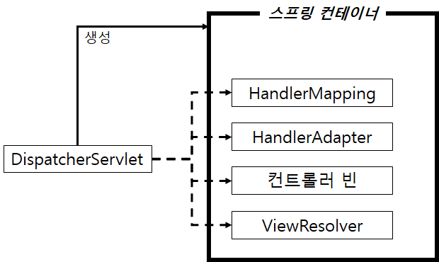

# @EnableWebMvc



## Spring MVC Beans

Dispatcher Servlet의 동작 과정을 살펴보면서 Spring MVC의 전반적인 프로세스를 살펴보았다. 통신 과정에서는 다양한 빈들을 생성하고 사용하였다. 그렇다면 어떤 bean 들이 있었을까?

### WebApplicationContext에 등록된 bean 정보

다음은 스프링 공식 문서에 설명하는 SpringMVC 관련하여 WebApplicationContext 에 등록된 빈들에 대한 정보이다.

**Special beans in the `WebApplicationContext`**

| Bean type | Explanation |
| :--- | :--- |
| [controllers](https://docs.spring.io/spring/docs/3.0.0.M4/spring-framework-reference/html/ch15s03.html) | Form the `C` part of the MVC. |
| [handler mappings](https://docs.spring.io/spring/docs/3.0.0.M4/spring-framework-reference/html/ch15s04.html) | Handle the execution of a list of pre-processors and post-processors and controllers that will be executed if they match certain criteria \(for example, a matching URL specified with the controller\). |
| [view resolvers](https://docs.spring.io/spring/docs/3.0.0.M4/spring-framework-reference/html/ch15s05.html) | Resolves view names to views. |
| [locale resolver](https://docs.spring.io/spring/docs/3.0.0.M4/spring-framework-reference/html/ch15s06.html) | A [locale resolver](https://docs.spring.io/spring/docs/3.0.0.M4/spring-framework-reference/html/ch15s06.html) is a component capable of resolving the locale a client is using, in order to be able to offer internationalized views |
| Theme resolver | A [theme resolver](https://docs.spring.io/spring/docs/3.0.0.M4/spring-framework-reference/html/ch15s07.html) is capable of resolving themes your web application can use, for example, to offer personalized layouts |
| multipart file resolver | Contains functionality to process file uploads from HTML forms. |
| [handler exception resolvers](https://docs.spring.io/spring/docs/3.0.0.M4/spring-framework-reference/html/ch15s09.html) | Contains functionality to map exceptions to views or implement other more complex exception handling code. |

보통 우리는 Controller까지만 bean으로 등록하지 나머지 bean들은 별도로 등록하지 않았다.

### 다른 bean 정보들은 어떻게 등록되었는가?

스프링 부트의 경우 spring-boot-starter-web 스타터만 import 해주면 자동 완성으로 인해 아래와 같이 mvc 관련된 bean 들에 대한 설정을 대신 해준다.

* `ContentNegotiatingViewResolver` \(요청이 원하는 뷰를 탐색하고 반환\) `BeanNameViewResolver` beans \(뷰를 찾을 때 빈 이름으로 찾게 도와준다\)
* 정적 리소스를 지원\(WebJars\)
* `Converter`, `GenericConverter`, `Formatter` beans.
* `HttpMessageConverters`
* `MessageCodesResolver`
* Static `index.html`
* 커스텀 `Favicon`
* `ConfigurableWebBindingInitializer` bean

## MVC 관련 bean들을 커스터마이징 하고 싶다면 어떻게 해야 할까?

스프링 부트의 자동완성 덕분에 우리는 별다른 bean 설정 없이 mvc 기능을 사용할 수 있다. 하지만 애플리케이션을 개발하다 보면 다양한 요구사항이 발생할 수 있게 되고 우리는 기본 동작하는 빈들을 커스터마이징 하고 싶다면 어떻게 해야 할까?

기존에 설정된 bean 설정을 유지하고 기능을 확장하고 싶다면 `@EnableWebMvc` 없이 `WebMvcConfigurer` 타입의`@Configuration` 클래스를 추가하면 된다.

```java
@Configuration
public class WebConfig implements WebMvcConfigurer{
    @Override
    public void configureViewResolvers(ViewResolverRegistry registry) {
        registry.jsp("/WEB-INF/",".jsp");
    }
}
```

`RequestMappingHandlerMapping`, `RequestMappingHandlerAdapter`, MVC 커스트마이징을 하면서 `ExceptionHandlerExceptionResolver`인스턴스를 제공하기 원하면, `WebMvcRegistrations` 타입의 빈을 선언하고 커스텀 인스턴스로 사용 할 수 있다.

```java
@Configuration
public class CustomRequestMappingHandlerMapping {
    @Bean
    public WebMvcRegistrations webMvcRegistrations() {
        return new WebMvcRegistrations() {
            @Override
            public RequestMappingHandlerMapping getRequestMappingHandlerMapping() {
                return new ApiVersionRequestMappingHandlerMapping("v");
            }
        };
    }
}
```

Spring MVC 의 완전한 제어를 원한다면 `@EnableWebMvc` 로 어노테이트된 `@Configuration` 을 추가할 수 있다. 또는 `@Configuration` 어노테이트된 `DelegatingWebMvcConfiguration` 을 사용할 수 있다.

```java
@Configuration
@EnableWebMvc
public class WebConfig{
    @Override
    public RequestMappingHandlerMapping requestMappingHandlerMapping() {
        RequestMappingHandlerMapping handlerMapping = super.requestMappingHandlerMapping();
        handlerMapping.setRemoveSemicolonContent(false);
        handlerMapping.setOrder(1);
        return handlerMapping;
    }
}

@Configuration
public class WebConfig extends DelegatingWebMvcConfiguration {
    @Override
    public RequestMappingHandlerMapping requestMappingHandlerMapping() {
        RequestMappingHandlerMapping handlerMapping = super.requestMappingHandlerMapping();
        handlerMapping.setRemoveSemicolonContent(false);
        handlerMapping.setOrder(1);
        return handlerMapping;
    }
}
```

## @EnableWebMvc은 어떻게 MVC 관련된 bean들을 수정할 수 있을까?

@EnableWebMvc 애노테이션을 살펴보면 해답을 알 수 있다.

```java
*
 * @author Dave Syer
 * @author Rossen Stoyanchev
 * @since 3.1
 * @see org.springframework.web.servlet.config.annotation.WebMvcConfigurer
 * @see org.springframework.web.servlet.config.annotation.WebMvcConfigurationSupport
 * @see org.springframework.web.servlet.config.annotation.DelegatingWebMvcConfiguration
 */
@Retention(RetentionPolicy.RUNTIME)
@Target(ElementType.TYPE)
@Documented
@Import(DelegatingWebMvcConfiguration.class)
public @interface EnableWebMvc {
}
```

EnableWebMvc 애노테이션 내부엔 DelegatingWebMvcConfiguration 클래스를 import한 것을 볼수 있다.

## DelegatingWebMvcConfiguration는 어떤 기능을 제공하는가?

DelegatingWebMvcConfiguration 클래스 내부를 살펴보면 WebMvcConfigurationSupport 클래스를 상속 받아 Web 관련 빈들을 커스터마이징 할 수 있도록 해준다.

```java
@Configuration(proxyBeanMethods = false)
public class DelegatingWebMvcConfiguration extends WebMvcConfigurationSupport {

	private final WebMvcConfigurerComposite configurers = new WebMvcConfigurerComposite();

	@Autowired(required = false)
	public void setConfigurers(List<WebMvcConfigurer> configurers) {
		if (!CollectionUtils.isEmpty(configurers)) {
			this.configurers.addWebMvcConfigurers(configurers);
		}
	}

  ...

	@Override
	@Nullable
	protected MessageCodesResolver getMessageCodesResolver() {
		return this.configurers.getMessageCodesResolver();
	}

}
```

위의 코드를 보면 setConfigurers 메소드에서 WebMvcConfigurer 타입의 빈을 모두 주입받아서 WebMvcConfigurerComposite 타입의 객체에 주입하고 있다. 따라서 WebMvcConfigurer 타입의 빈들은 전부 WebMvcConfigurerComposite 객체에 주입이 된다. WebMvcConfigurer 타입의 빈들은 Web 관련 빈들을 초기화할 때 사용된다.

DelegatingWebMvcConfiguration는 WebMvcConfigurer 타입의 빈들을 통해서 등록되는 빈들을 커스터마이징 할 수 있게 해주는 정도의 역할만 하고 있다.

### 수정할 수 있는 기능목록

* HandlerMapping
  * RequestMappingHandlerMapping
  * HandlerMapping
  * BeanNameUrlHandlerMapping
  * HandlerMapping
  * HandlerMapping
* HandlerAdapter
  * RequestMappingHandlerAdapter
  * HttpRequestHandlerAdapter
  * SimpleControllerHandlerAdapter
* HandlerExceptionResolerComposite
  * ExceptionHandlerExceptionResolver
  * ResponseStatusExceptionResolver
  * DefaultHandlerExceptionResolver
* 기타
  * AntPathMather
  * UrlPathHelper
  * ContentNegotiationManager

## @EnableWebMvc를 사용하면 왜 완전한 제어를 한다고 표현할까?

스프링 MVC 자동구성은 `WebMvcAutoConfiguration`이 담당한다. 이 구성이 활성화되는 조건 중에 `WebMvcConfigurationSupport` 타입의 빈을 찾을 수 없을 때 라는 조건이 있다.

```java
@Configuration
@ConditionalOnWebApplication(type = Type.SERVLET)
@ConditionalOnClass({ Servlet.class, DispatcherServlet.class, WebMvcConfigurer.class })
@ConditionalOnMissingBean(WebMvcConfigurationSupport.class)
@AutoConfigureOrder(Ordered.HIGHEST_PRECEDENCE + 10)
@AutoConfigureAfter({ DispatcherServletAutoConfiguration.class,	ValidationAutoConfiguration.class })
public class WebMvcAutoConfiguration {
}
```

바로 이 조건\(`@ConditionalOnMissingBean(WebMvcConfigurationSupport.class)`\) 때문에 이미 빈이 생성되었기 때문에 기본 전략을 참고하지 못한다.

## WebMvcConfigurer

WebMvcConfigurer 인터페이스는 MVC 네임스페이스를 이용한 설정과 동일한 설정을 하는데 필요한 메소드를 정의하고 있다. 위에서 설명했듯이 HttpMessageConverter를 추가할 때 WebMvcConfigurer 인터페이스를 상속한 @Configuration 클래스를 만들고, configureMessageConverters 메소드를 구현해주면 된다. WebMvcConfigurerAdapter는 추상 클래스로 spring 5 이후에는 deprecated 되어 WebMvcConfigurer만 사용하면 된다.

#### WebMvcConfigurerAdapters 왜 deprecated 되었을까?

WebMvcConfigurerAdapters는 spring 5 이전에는 많이 사용하였는데 추상클래스로 되어 있기 때문에 사용자가 필요하지 않은 기능들은 구현할 필요가 없기 때문에 WebMvcConfigurerAdapters 클래스 사용을 권장하였다. 그러나 spring 5 부터는 인터페이스의 default method를 제공해주기 때문에 공통 구현을 제공하기 때문에 deprecated 되었다고 한다.

> Deprecated. as of 5.0 WebMvcConfigurer has default methods \(made possible by a Java 8 baseline\) and can be implemented directly without the need for this adapter

## 참고

* [https://pangtrue.tistory.com/84](https://pangtrue.tistory.com/84)
* [https://docs.spring.io/spring/docs/3.0.0.M4/spring-framework-reference/html/ch15s02.html](https://docs.spring.io/spring/docs/3.0.0.M4/spring-framework-reference/html/ch15s02.html)
* [https://seungwoo0429.tistory.com/37](https://seungwoo0429.tistory.com/37)
* [https://gunju-ko.github.io/spring/2018/06/28/@EnableWebMvc.html](https://gunju-ko.github.io/spring/2018/06/28/@EnableWebMvc.html)
* [http://honeymon.io/tech/2018/03/13/spring-boot-mvc-controller.html](http://honeymon.io/tech/2018/03/13/spring-boot-mvc-controller.html)

