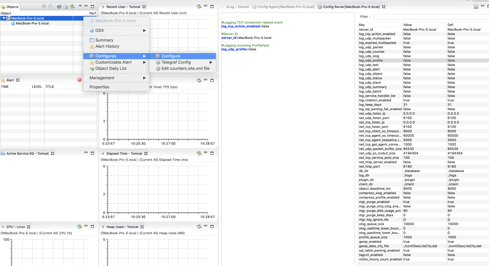

# CHAP 03. scouter 설정하기\(서버 및 에이전트\)

## scouter 서버 설정하기

scouter 서버는 스칼라\(Scala\) 언어로 되어 있으나, 이 언어는 자바 기반의 JVM에서 실행되는 언어이기 때문에 장비에 자바만 설치되어 있으면 큰 문제 없이 실행할 수 있다. scouter 서버는 컬렉터\(collector\)라고 부르기도 하는데, 대부분 서버라고 부른다.

### scouter 서버의 주요 역할

* 에이전트에서 전송한 데이터 수집 및 저장
* API 제공\(scouter-paper 등을 사용할 때 필요\)
* 집킨을 사용할 경우 집킨으로의 데이터 전송

### scouter 서버 설정 정보

#### scouter 서버 설정 하는 방법

* conf 디렉터리에 있는 scouter.conf 파일 수정
* 클라이언트에서 직접 수정



#### 반드시 확인해야 할 설정 정보

* server\_id : scouter 서버의 ID다. 만약 설정하지 않았을 경우 해당 서버의 호스트 이름이 서버 이름으로 나타난다.
* net\_tcp\_listen\_port : 서버가 대기하고 있는 TCP 포트 번호
* net\_udp\_listen\_port : 서버가 대기하고 있는 UDP 포트 번호
* db\_dir : 파일 기반으로 저장되는 데이터의 경로
* log\_dir : scouter 서버도 로그를 남기는데, 그 로그의 경로를 지정한다. 만약 존재하지 않는 디렉터리를 지정할 경우 정상적으로 시작되지 않을 수 있으니 유의한다.

## 한 대의 서버에서 여러 개의 수집 서버 실행하기

한 대의 서버에서 하나의 scouter 서버만 설정해 놓을 경우 운영은 가능하지만, 여러 서버에서 수집할 경우 데이터가 하나로 통합되어 보여주기 때문에 어떤 서버군에서 장애가 발생했는지 알아내기가 매우 어려워진다. 이러한 경우에는 다음과 같이 수집 서버 시작 스크립트의 자바 시작 옵션에 다음의 내용을 추가해준다.

```text
-Dscouter.config=/scouter/server/conf/member.conf
```

```text
// display.conf
server_id=display
net_tcp_listen_port=6100
net_udp_listen_port=6100
db_dir=/scouter/server/database/display
log_dir=/scouter/server/logs/display

// member.conf
server_id=member
net_tcp_listen_port=6110
net_udp_listen_port=6110
db_dir=/scouter/server/database/member
log_dir=/scouter/server/logs/member
```

여기서 가장 중요한 것은 포트 번호와 db\_dir이다. 이 값들을 다르게 설정하지 않으면 모든 데이터들이 정상적으로 저장되지 않을 수 있으므로 반드시 각 수집서버마다 다르게 설정할 것을 권장한다.

몇 개의 자바 인스턴스까지 scouter 수집 서버 한 대로 모니터링이 가능할까?

필자가 사용해본 결과 최대 20개까지는 하나의 인스턴스에서 모니터링이 가능하다고 한다. 하지만 인스턴스 갯수보다 중요한 것은 TPS이다. TPS가 높다는 이야기는 수집 서버에 더 많은 데이터가 들어온다는 의미로 그만큼 수집 서버는 바빠진다는 이야기다. 그래서 하나의 인스턴스가 1,000TPS가 넘는다면, 해당 수집 서버는 그 인스턴스 하나만 모니터링 가능할 수도 있다. 그래서 보통 이야기하는 것은 1,000TPS 기준이다.

## scouter 호스트 에이전트 설정하기

scouter 에이전트는 데이터를 취합해서 수집 서버로 전달하는 역할을 한다.

#### scouter에서 제공하는 에이전트

* 호스트 에이전트
* 자바 에이전트
* 배치 에이전트

### scouter 에이전트 역할

* 서버의 리소스 상태 데이터들을 취합하여 전송
  * CPU
  * 메모리\(memory\)
  * 네트워크\(network\)
  * 디스크\(disk\)
* 윈도우, 리눅스, 맥 OS 모니터링이 가능

#### scouter 에이전트 필수 설정 정보

* net\_collector\_ip : 수집 서버의 IP를 지정한다
* net\_collector\_tcp\_port : 수집 서버의 TCP 포트를 지정한다
* net\_collector\_udp\_port : 수집 서버의 UDP 포트를 지정한다

## scouter 자바 에이전트 설정하기 - 기초

자바 에이전트는 Tomcat이나 Jetty 등 자바 기반의 WAS\(Web Application Server\)를 모니터링하거나 임의로 만든 Demon 프로그램을 모니터링할 수도 있다.

#### WAS 시작 옵션 정보

```text
SCOUTER_AGENT_DIR=${SCOUTER_HOME_위치}/scouter/agent.java
JAVA_OPTS=" ${JAVA_OPTS} -javaagent:${SCOUTER_AGENT_DIR}/scouter.agent.jar"
JAVA_OPTS=" ${JAVA_OPTS} -Dscouter.config=${SCOUTER_AGENT_DIR}/scouter.conf"
```

#### 자바 에이전트 설정 파일

```text
obj_name=scouter_troubleshooting_1
net_collector_ip=127.0.0.1
net_collector_tcp_port=6100
net_collector_udp_port=6100
```

## 자바의 ClassFileTransformer

자바에는 java.lang.instrument라는 패키지가 있다. 이 패키지에는 ClassFileTransformer라는 인터페이스가 존재한다. ClassFileTransformer 인터페이스에는 transform\(\) 메서드에 클래스가 바이트 배열로 넘어오면 필요한 내용을 수정한 후 JVM에 바이트 배열로 돌려준다. ClassFileTransformer 클래스는 scouter 뿐만 아니라 pinpoint나 다른 모니터링 도구들의 핵심이다. 이렇게 변환하는 작업을 통해 필요한 코드를 삽입하면 어떤 쿼리를 수행하였는지, 어떤 메서드를 얼마나 수행하였는지, 어떤 API가 호출되었는지를 알 수 있다.

그런데 이 변환 작업은 JVM이 시작될 때 호출된다는 단점이 있다. 그래서 scouter에서 관련된 설정을 변경한 후에는 반드시 모니터링되는 인스턴스를 재시작해야만 한다.

