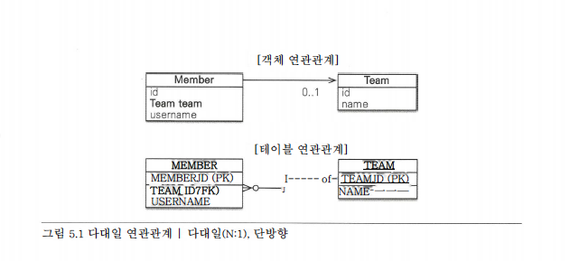
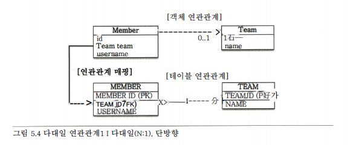
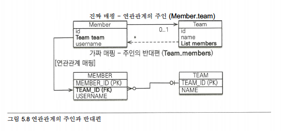

# 5장 연관관계 매핑 기초

객체 관계 매핑(ORM)에서 가장 어려운 부분이 바로 객체 연관관계와 테이블 연관관계를 매핑하는 일이다.

### 단방향 연관관계



* 객체 연관관계
  * 회원 객체는 [`Member.team`](http://member.team) 필드로 팀 객체와 연관관계를 맺는다.
  * 회원 객체와 팀 객체는 단방향 관계다. 반대 방향인 `team` → `member`를 접근하는 필드는 없다.
*   테이블 연관관계

    * 회원 테이블은 `TEAM_ID` 외래 키로 팀 테이블과 연관관계를 맺는다.
    * 회원 테이블과 팀 테이블은 `양방향 관계`다.

    ```
    SELECT *
    FROM MEMBER M
    JOIN TEAM T ON M.TEAM_ID = T.ID
    ```

    다음은 반대인 팀과 회원을 조인하는 SQL이다.

    ```
    SELECT *
    FROM TEAM T
    JOIN MEMBER M ON T.TEAM_ID = M.TEAM_ID
    ```


**객체 연관관계와 테이블 연관관계의 가장 큰 차이**\
****\
****참조를 통한 연관관계는 언제나 `단방향`이다. 객체간에 연관관계를 양방향으로 만들고 싶으면 반대쪽에도 필드를 추가해서 `참조`를 보관해야 한다. **하지만 정확히 이야기하면 이것은 양방향 관계가 아니라 서로 다른 단방향 관계 2개다.**


#### 객체 연관관계 vs 테이블 연관관계 정리

* **객체는 `참조(주소)`로 연관관계를 맺는다.**
* **테이블은 `외래 키`로 연관관계를 맺는다.**

연관된 데이터를 조회할 때 객체는 참조를 사용하지만 테이블은 `조인(JOIN)`을 사용한다. 객체는 `참조`를 사용해서 연관관계를 탐색할 수 있는데 이것을 `객체 그래프 탐색`이라 한다.

### 객체 관계 매핑

이제 `JPA`를 사용해서 둘을 매핑 해보자.



```java
@Entity
public class Member {
	@Id
	@Column(name = "MEMBER_ID")
	private String id;
	private String username;
	
	//연관관계 매핑
	@ManyToOne
	@JoinColumn(name="TEAM_ID")
	private Team team;
	
	//연관관계 설정
	public void setTeam(Team team) {
		this.team = team;
	}
	//Getter, Setter ...
}
```

```java
@Entity
public class Team {
	@Id
	@Column (name = "TEAM_ID")
	private String id;
	
	private String name;
	//Getter, Setter ...
}
```

Member.team과 MEMBER.TEAM\_ID를 매핑하는 것이 연관관계 매핑이다.

* `@ManyToOne` : 이름 그대로 다대일(N:1) 관계라는 매핑 정보다.
* `@JoinColumn(name="TEAM_ID")` : 조인 컬럼은 외래 키를 매핑할 때 사용한다.

### @JoinColumn

@JoinColumn은 외래 키를 매핑할 때 사용한다.

[@JoinColumn](https://www.notion.so/39ec300afcf84ad2b54d2617ff52270a)

| 속성                                                                                               | 기능                                               | 기본값                                         |
| ------------------------------------------------------------------------------------------------ | ------------------------------------------------ | ------------------------------------------- |
| name                                                                                             | 매핑할 외래 키 이름                                      | <p>필드명 + </p><p>"_"+ 참조하는 테이블의 기본 키 컬럼명</p> |
| referencedColumnName                                                                             | 외래 키가 참조하는 대상 테이블의 컬럼명                           | 참조하는 테이블의 기본키 컬럼                            |
| foreignKey                                                                                       | 외래 키 제약조건을 직접 지정할 수 있다. 이 속성은 테이블을 생성할 때만 사용한다.  |                                             |
| <p>unique</p><p>nullable</p><p>insertable</p><p>updatable</p><p>columnDefinition</p><p>table</p> | @Column의 속성과 같                                   |                                             |


@JoinColumn 생략

기본 전략 : 필드명 + "\_" + 참조하는 테이블의 컬럼명\
예시 : 필드명(team) + "\_" + 참조하는 테이블의 컬럼명(TEAM\_ID) team\_TEAM\_ID


### @ManyToOne

@ManyToOne 어노테이션은 다대일 관계에서 사용한다.

| 속성           | 기능                                                             |
| ------------ | -------------------------------------------------------------- |
| optional     | false로 설정하면 연관된 엔티티가 항상 있어야 한다                                 |
| fetch        | 글로벌 페치 전략을 설정한다. 자세한 내용은 8장 참고                                 |
| cascade      | 영속성 전이 기능을 사용한다. 자세한 내용은 8장 참고                                 |
| targetEntity | 연관된 엔티티의 타입 정보를 설정한다. 이 기능은 거의 사용하지 않는다. 제네릭으로 타입 정보를 알 수 있다.  |


`방향 관계`를 매핑할 때 둘 중 어떤 것을 사용해야 할지는 `반대편 관계`에 달려 있다. 반대편이 `일대다` 관계면 `다대일을` 사용하고 반대편이 `일대일` 관계면 `일대일`을 사용하면 된다. 참고로 일대일 관계는 다음 장에서 설명한다.


### 연관관계 사용

#### 조회

연관관계가 있는 엔티티를 조회하는 방법은 크게 2가지다.

*   객체 그래프 탐색(객체 연관관계를 사용한 조회)

    ```
    Member member = em.find(Member.class, "member1");
    Team team = member.getTeam(); // 객체 그래프 탐색
    System.out.println("팀 이름 = " + team.getName());

    // 출력 결과 : 팀 이름 = 팀1
    ```
*   객체지향 쿼리 사용(JPQL)

    ```
    private static void queryLogicJoin(EntityManager em) {
    String jpql = "select m from Member m join m.team t where ” +” t. name=: teamName ";

    List<Member> resultList = em.createQuery(jpql, Member.class)
    	.setParameter ("teamName", "팀 1");
    	.getResultList();

    for (Member member : resultList) {
    	System. out. printin (" [query] member. username=,' +member.getUsername());
    }

    // 결과: [query] member.username = 회원1
    // 결과: [query] member.username = 회원2
    ```

#### 수정

```java
private static void updateRelation(EntityManager em) {
	//새로운 팀 2
	Team team2 = new Team(”team2”, ”팀2”);
	em.persist(team2);
	
	//회원 1 에 새로운 팀2 설정
	Member member = em.find(Member.class, "memberl");
	member.setTeam(team2);
}
```

실행되는 수정 SQL은 다음과 같다.

```
UPDATE MEMBER
SET 
	TEAM_ID='team2',
WHERE
	ID='member1'
```

### 양방향 연관관계

데이터베이스 테이블은 `외래 키` 하나로 `양방향`으로 조회할 수 있다. 따라서 데이터베이스에 추가할 내용은 전혀 없다.

```java
@Entity
public class Member {
  @Id
  @Column (name = ”MEMBER_ID”)
  private String id;
  private String username;

  @ManyToOne
  @JoinColumn(name="TEAM_ID H)
  private Team team;

  //연관관계 :설정
  public void setTeam(Team team) {
    this.team = team;
  }
  //Getter, Setter ...  
}
```

회원 엔티티에는 변경한 부분이 없다. 팀 엔티티를 보자.

```java
@Entity
public class Team {
  @Id
  @Column(name = ”TEAM_ID”)
  private String id;

  private String name;

  //==추가==//
  @OneToMany (mappedBy = "team")
  private List<Member> members = new ArrayList<Member> () ;

  ...
}
```

### 연관관계의 주인


**@OneToMany만 있으면 되지 mappedBy는 왜 필요할까?**\
\
객체에는 `양방향` 연관관계라는 것이 없다. 서로 다른 `단방향` 연관관계 `2개`를 애플리케이션 로직으로 잘 묶어서 양방향인 것처럼 보이게 할 뿐이다.


**엔티티를 양방향 연관관계로 설정하면 객체의 참조는 둘인데 외래 키는 하나다.** 따라서 둘 사이에 차이가 발생한다. 이런 차이로 인해 `JPA`에서는 두 객체 연관관계 중 하나를 정해서 테이블의 외래키를 관리해야 하는데 이것을 연관관계의 주인`(OWNER)`이라 한다.

`연관관계`의 주인만이 데이터베이스 연관관계와 매핑되고 외래 키를 관리(등록, 수정, 삭제)할 수 있다. 반면에 주인이 아닌 쪽은 읽기만 할 수 있다.

연관관계의 주인을 정한다는 것은 사실 외래 키 관리자를 선택하는 것이다.

#### 연관관계의 주인은 외래 키가 있는 곳

연관관계의 주인은 테이블에 외래 키가 있는 곳으로 정해야 한다. 여기서는 회원 테이블이 외래 키를 가지고 있으므로 `Member.team`이 주인이 된다.



### 양방향 연관관계의 주의점

양방향 연관관계를 설정하고 가장 흔히 하는 실수는 연관관계의 `주인`에는 값을 입력하지 않고, 주인이 아닌 곳에만 값을 입력하는 것이다. **데이터베이스에 외래 키값이 정상적으로 저장되지 않으면 이것부터 의심해보자.**

```java
public void testSaveNonOwner() {
  //회원1 저장
  Member member 1 = new Member ("member 1", ''회원1”);
  em.persist(member1);

  //회원2 저장
  Member member2 = new Member (”member2", "회원2”);
  em.persist(member2);

  Team teaml = new Team("teaml", ”팀 1”);
  
  //주인이 아닌 곳만 연관관계 설정
  teaml.getMembers().add(member1);
  teaml.getMembers().add(member2);
  em.persist(teaml);
}
```

| MEMBERID | USERNAME | TEAMID |
| -------- | -------- | ------ |
| member1  | 회원1      | null   |
| member2  | 회원2      | null   |

이는 연관관계의 주인이 아닌 `Team.members`에만 값을 저장했기 때문이다. 예제 코드는 연관관계의 주인인 `Member.team`에 아무 값도 입력하지 않았다. 따라서 `TEAM_ID` 외래 키의 값도 `null`이 저장된다.

### 순수한 객체까지 고려한 양방향 연관관계

객체 관점에서 양쪽 방향에 모두 값을 입력해주는 것이 가장 안전하다. 양쪽 방향 모두 값을 입력하지 않으면 `JPA`를 사용하지 않는 순수한 객체 상태에서 심각한 문제가 발생할 수 있다.

```java
public void testORM_양방향 () {
  //팀1 저장
  Team teaml : new Team ("teaml”, "팀 1”) ;
  em.persist(team1);

  Member member 1 = new Member ("member 1", "회원1”) ;
  
  //양방향 연관관계 설정
  member1.setTeam(teaml) ; //연관관계 설정 member 1 -> teaml
  team1.getMembers().add(member1); //연관관계 설정 teaml -> member 1
  em.persist(member1);

  Member member2 = new Member ("meinber2", ”회원2”) ;
  
  //양방향 연관관계 설정
  member2.setTeam (teaml); //연관관계 설정 member2 -> teaml
  team1.getMembers().add(member2); "연관관계 설정 teaml -> member2
  em.persist(member2);
}
```

### 연관관계 편의 메소드

양방향 연관관계는 결국 양쪽 다 신경 써야 한다. 이전에는 `member.setTeam(team)`과 `team.getMembers.add(member)`를 각각 호출하다 보면 실수로 둘 중 하나만 호출해서 양방향이 깨질 수 있다. 양방향 관계에서 두 코드는 하나인 것처럼 사용하는 것이 안전하다.

```java
public class Member {
  private Team team;
  public void setTeam(Team team) {
    this.team = team;
    team.getMembers().add(this);
  }
  ...
}
```

### 정리

**연관관계가 하나인 단방향 매핑은 언제나 연관관계의 주인이라는 점이다.** 양방향은 여기에 주인이 아닌 연관관계를 하나 추가했을 뿐이다. 결국 단방향과 비교해서 양방향의 장점은 반대방향으로 객체 그래프 탐색 기능이 추가된 것뿐이다.

* **단방향 매핑만으로 테이블과 객체의 연관관계 매핑은 이미 완료되었다.**
* **단방향을 양방향으로 만들면 반대방향으로 객체 그래프 탐색 기능이 추가된다.**
* **양방향 연관관계를 매핑하려면 객체에서 양쪽 방향을 모두 관리해야 한다.**

#### 연관관계의 주인을 정하는 기준

단방향은 항상 `외래 키`가 있는 곳을 기준으로 매핑하면 된다. 하지만 양방향은 연관관계의 `주인(Owner)`이라는 이름으로 인해 오해가 있을 수 있다. 비즈니스 로직상 더 중요하다고 `연관 관계`의 주인으로 선택하면 안 된다. 비즈니스 중요도를 배제하고 단순히 외래 키 관리자 정도의 의미만 부여해야 한다. **따라서 `연관 관계`의 주인은 외래 키의 위치와 관련해서 정해야지 비즈니스 중요도로 접근하면 안 된다.**


**양방향 매핑 시에는 무한 루프에 빠지지 않게 조심해야 한다.**

`Member.toString()`에서 getTeam()을 호출하고 `Team.toString()`에서 getMember()를 호출하면 `무한 루프`에 빠질 수 있다.



**일대다를 연관관계의 주인으로 선택하는 것이 불가능한 것만은 아니다.**\
\
팀 엔티티의 `Team.members`를 연관관계의 주인으로 선택할 수는 있다. 하지만 성능과 관리 측면에서 권장하지 않는다. 될 수 있으면 외래 키가 있는 곳을 연관관계의 주인으로 선택하자


#### 질문

* flush()를 사용할때나 안할때 왜 다를까?
* lombok → toString, euqals 이슈

