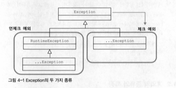
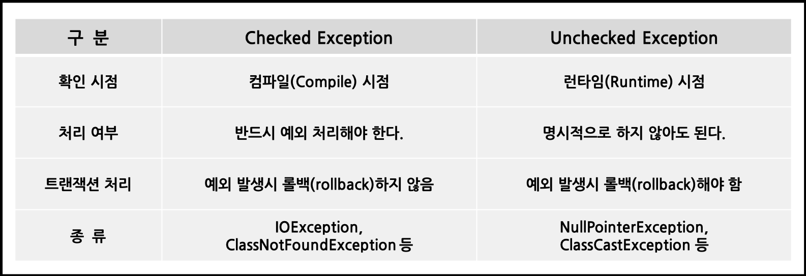

# 4장 예외

예외가 관련된 코드는 자주 엉망이 되거나 무성의하게 만들어지기 쉽다. 때론 잘못된 예외처리 코드 때문에 찾기 힘든 버그를 낳을 수도 있고, 생각지 않았던 예외상황이 발생했을 떄 상상 이상으로 난처해질 수도 있다.

## 사라진 SQLException

```java
public void deleteAll() throws SQLException { 
    this.jdbcContext.executeSql("delete from users");
)

public void deleteAll() { 
    this.jdbcTemplate.update("delete from users");
}
```

JdbcTemplate 적용 이전에는 있었던 throws SQLException 선언이 적용 후에는 사라졌음을 알 수 있다.

### 예외 블랙홀

예외가 발생하면 그것을 catch 블록을 써서 잡아내는 것까지는 좋은데 그리고 아무것도 하지 않고 별문제 없는 것처럼 넘어가 버리는 건 정말 위험한 일이다. 그것은 예외가 발생했는데 그것을 무시하고 계속 진행해버리기 때문이다.

```java
} catch (SQLException e) { 
    System.out.println(e);
}
```

```java
} catch (SQLException e) { 
    e.printStackTraceO;
)
```

콘솔 로그를 누군가가 계속 모니터링하지 않는 한 이 예외 코드는 심각한 폭탄으로 남아 있을 것이다. 모든 예외는 적절하게 복구되든지 아니면 작업을 중단시키고 운영자 또는 개발자에게 분명하게 통보돼야 한다.

### 무의미하고 무책임한 throws

다음과 같이 메소드 선언에 throws Exception을 기계적으로 붙이는 개발자도 있다.

```java
public void method1() throws Exception {
    method2();
)
public void method2() throws Exception {
    method3();
}
public void method3() throws Exception {
    ...
}
```

예외를 흔적도 없이 먹어치우는 예외 블랙홀보다는 조금 낫긴 하지만 이런 무책임한 throws 선언도 심각한 문제점이 있다. 자신이 사용하려는 메소드에 throws Exception이 선언되어 있다면 정말 무엇인가 실행 중에 예외적인 상황이 발생할 수 있다는 것인지, 아니면 그냥 습관적으로 복사해서 붙여놓은 것인지 알 수가 없다. 결국 이런 메소드를 사용하는 메소드에서도 역시 throws Exception을 따라서 붙이는 수밖에 없다.

## 예외의 종류와 특징

### Error

java.lang.Error 클래스의 서브클래스들이다. 그래서 주로 자바 VM에서 발생시키는 것이고 애플리케이션 코드에서 잡으려고 하면 안 된다. OutOfMemoryError나 ThreadDeath 같은 에러는 catch 블록으로 잡아봤자 아무런 대응 방법이 없기 때문이다.

### Exception과 체크 예외

java.lang.Exception 클래스와 그 서브클래스로 정의되는 예외들은 에러와 달리 개발자들이 만든 애플리케이션 코드의 작업 중에 예외상황이 발생했을 경우에 사용된다. Exception 클래스는 다시 체크 예외와 언체크 예외로 구분된다.



일반적으로 예외라고 하면 Exception 클래스의 서브클래스 중에서 RuntimeException을 상속하지 않은 것만을 말하는 체크 예외라고 생각해도 된다. 사용할 메소드가 체크 예외를 던진다면 이를 catch 문으로 잡든지, 아니면 다시 throws를 정의해서 메소드 밖으로 던져야 한다. 그렇지 않으면 컴파일 에러가 발생한다.


### RuntimeException과 언체크/런타임 예외

java.lang.RuntimeException 클래스를 상속한 예외들은 명시적인 예외처리를 강제하지 않기 때문에 언체크 예외라고 불린다. 런타임 예외는 주로 프로그램의 오류가 있을 때 발생하도록 의도된 것들이다. 피할 수 있지만 개발자가 부주의해서 발생할 수 있는 경우에 발생하도록 만든 것이 런타임 예외다.



## 예외처리 방법

### 예외 복구

첫 번째 예외처리 방법은 예외상황을 파악하고 문제를 해결해서 정상 상태로 돌려놓는 것이다. 예를 들어 사용자가 요청한 파일을 읽으려고 시도했는데 해당 파일이 없다거나 다른 문제가 있어서 읽히지가 않아서 IOException이 발생했다고 생각해보자. 이때는 사용자에게 상황을 알려주고 다른 파일을 이용하도록 안내해서 예외상황을 해결할 수 있다. 예외처리 코드를 강제하는 체크 예외들은 이렇게 예외를 어떤 식으로든 복구할 가능성이 있는 경우에 사용한다.

```java
int maxretry = MAX_RETRY; 
while(maxretry — > 0) {
    try {
        ... // 예외가 발생할 가능성이 있는 시도
        return;
    }
    catch(SomeException e) {
        // 작업 성공
        // 로그 출력. 정해진 시간만큼 대기
    } finally {
        // 리소스 반납. 정리 작업
    } 
}
throw new RetryFailedException(); // 최대 재시도 횟수를 넘기면 직접 예외 발생
```

### 예외처리 회피

두 번째 방법은 예외처리를 자신이 담당하지 않고 자신을 호출한 쪽으로 던져버리는 것이다. throws 문으로 선언해서 예외가 발생하면 알아서 던져지게 하거나 catch 문으로 일단 예외를 잡은 후에 로그를 남기고 다시 예외를 던지는 것이다.

```java
public void add() throws SQLException { 
  try {
    // JDBC API
  }
  catch(SQLException e) {
    // 로그 출력
	  throw e;
	} 
}
```

DAO가 SQLException을 생각 없이 던져버리면 어떻게 될까? DAO에서 던진 SQLException을 서비스 계층 메소드가 다시 던지고, 컨트롤러도 다시 지도록 선언해서 예외는 그냥 서버로 전달되고 말 것이다. 예외를 회피하는 것은 예외를 복구하는 것처럼 의도가 분명해야 한다.

### 예외 전환

예외 회피와 달리, 발생한 예외를 그대로 넘기는 게 아니라 적절한 예외로 전환해서 던진다는 특징이 있다. 예외 전환은 두 가지 목적으로 사용된다. 첫째는 내부에서 발생한 예외를 그대로 던지는 것이 그 예외상황에 대한 적절한 의미를 부여해주지 못하는 경우에 의미를 분명하게 해줄 수 있는 예외로 바꿔주기 위해서다.

```java
public void add(User user) throws DuplicateUserldException, SQLException { 
    try {
        // ]DBC를 이용해 user 정보를 애에 추가하는 코드 또는
        // 그런 기능을 가진 다른 SQLException을 던지는 메소드를 호출하는 코드 
    }
    catch(SQLException e) {
        // ErrorCode가 MySQL의 "Duplicate Entry(1062)"이면 예외 전환 
        if (e.getErrorCode() == MysqlErrorNumbers.ER_DUP_ENTRY)
            throw DuplicateUserIdException(); 
        else
            throw e; // 그 외의 경우는 SQLException 그대로
    } 
}
```

보통 전환하는 예외에 원래 발생한 예외를 담아서 중첩 예외로 만드는 것이 좋다.

```java
// case 1
catch(SQLException e) {
    ...
    throw DuplicateUserldException(e);
}

// case 2
catch(SQLException e) {
    ...
    throw DuplicateUserIdException().initCause(e);
}
```

예외 전환은 주로 예외처리를 제하는 체크 예외를 언체크 예외인 런타임 예외로 바꾸는 경우에 사용한다.

## 예외처리 전략

### 런타임 예외의 보편화

일반적으로는 체크 예외가 일반적인 예외를 다루고, 언체크 예외는 시스템 장애나 프로그램상의 오류에 사용한다고 했다. 말 그대로 예외적인 상황이기 때문에 자바는 이를 처리하는 catch 블록이나 throws 선언을 강제하고 있다는 점이다.

DuplicatedUserIdException은 충분히 복구 가능한 예외이므로 add\(\) 메소드를 사용하는 쪽에서 잡아서 대응할 수 있다. 하지만 SQLException은 대부분 복구 불가능한 예외이므로 잡아봤자 처리할 것도 없고, 결국 throws를 타고 계속 앞으로 전달되다가 애플리케이션 밖으로 던져질 것이다. 그럴 바에는 그냥 런타임 예외로 포장해 던져버려서 그 밖의 메소드들이 신경 쓰지 않게 해주는 편이 낫다.

```java
public class DuplicateUserldException extends RuntimeException { 
    public DuplicateUserIdException(Throwable cause) {
        super(cause); 
    }
}
```

DuplicatedUserIdException 외에 시스템 예외에 해당하는 SQLException은 언체크 예외가 됐다. 따라서 메소드 선언의 throws에 포함시킬 필요가 없다.

```java
public void add() throws DuplicateUserldException { 
    try {
        // ]DBC를 이용해 user 정보를 애에 추가하는 코드 또는
        // 그런 기능이 있는 다른 SQLException을 던지는 메소드를 호출하는 코드
    }
    catch (SQLException e) {
        if (e.getErrorCode() == MysqlErrorNumbers.ER_DUP_ENTRY)
            throw new DuplicateUserldException(e); // 예외 전환
        else
            throw new RuntimeException(e); // 에외 포장
    }
}
```

런타임 예외를 사용하는 경우에는 API 문서나 레퍼런스 문서 등을 통해, 메소드를 사용할 때 발생할 수 있는 예외의 종류와 원인, 활용 방법을 자세히 설명해두자.

## 예외 전환

예외 전환의 목적은 두 가지라고 설명했다. 하나는 앞에서 적용해본 것처럼 런타임 예외로 포장해서 굳이 필요하지 않은 catch/throws를 줄여주는 것이고, 다른 하나는 로우레벨의 예외를 좀 더 의미 있고 추상화된 예외로 바꿔서 던져주는 것이다.

스프링의 JdbcTemplate이 던지는 DataAccessException은 일단 런타임 예외로 SQLException을 포장해주는 역할을 한다. 그래서 대부분 복구가 불가능한 예외인 SQLException에 대해 애플리케이션 레벨에서는 신경 쓰지 않도록 해주는 것이다. 또한 DataAccessException은 SQLException에 담긴 다루기 힘든 상세한 예외정보를 의미 있고 일관성 있는 예외로 전환해서 추상화해주려는 용도로 쓰이기도 한다.

### 정리

* 예외를 잡아서 아무런 조취를 취하지 않거나 의미 없는 throws 선언을 남발하는 것은 위험하다.
* 예외는 복구하거나 예외처리 오브젝트로 의도적으로 전달하거나 적절한 예외로 전환해야 한다.
* 좀 더 의미 있는 예외로 변경하거나, 불필요한 catch/throws를 피하기 위해 런타임 예외로 포장하는 두 가지 방법의 예외 전환이 있다.
* 복구할 수 없는 예외는 가능한 한 빨리 런타임 예외로 전환하는 것이 바람직하다.
* 애플리케이션의 로직을 담디 위한 예외는 체크 예외로 만든다.
* JDBC의 SQLException은 대부분 복구할 수 없는 예외이므로 런타임 예외로 포장해야 한다.
* SQLException의 에러 코드는 DB에 종속되기 때문에 DB에 독립적인 예외로 전환될 필요가 있다.
* 스프링은 DataAccessException을 통해 DB에 립적으로 적용 가능한 추상화된 런타임 예외 계층을 제공한다.
* DAO를 데이터 엑세스 기술에서 독립시키려면 인터페이스 도입과 런타임 예외 전환, 기술에 독립적인 추상화된 예외로 전환이 필요하다.

