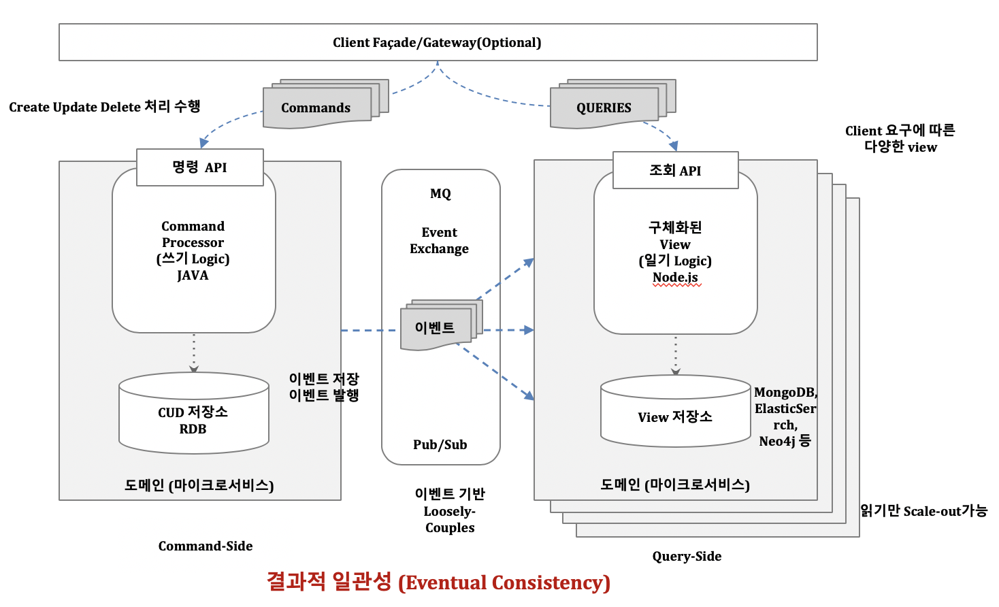

# 3장 함수

#### 자, 3분을 줄테니 코드를 살펴보자.

```java
public static String testableHtml (
    PageData pageData,
    boolean includeSuiteSetup
) throws Exception {
    WikiPage wikiPage = pageData.getWikiPage();
    StringBuffer buffer = new StringBuffer();
    if (pageData.hasAttribute("Test")) {
        if (includeSuiteSetup) {
            WikiPage suiteSetup = 
                pageCrawlerImpl.getInheritedPage(
                    SuiteResponder.SUITE_SETUP_NAME, wikiPage
            );
            if (suiteSetup != null) {
                WikiPagePath pagePath = 
                    suiteSetup.getPageCrawler().getFullPath(suiteSetup);
                String pagePathName = pathParser.render(pagePath);
                buffer.append("!include -setup .")
                      .append(pagePathName)
                      .append("\\n");
            }
        }
        WikiPage setup =
            pageCrawlerImpl.getInheritedPage("SetUp". wikiPage);
        if(setup != null) {
            WikiPagePath setupPath =
                wikiPage.getPageCrawler().getFullPath(setup);
            String setupPathName = PathParser.render(setupPath);
            buffer.append("!include -setup .")
                  .append(setupPathName)
                  .append("\\n");
        }
    }
    buffer.append(pageData.getContent());
    if (pageData.hasAttribute("Test")) {
        WikiPage teardown = 
            PageCrawlerImpl.getInheritedPage("TearDown", wikiPage);
        if (teardown != null) {
            WikiPagePath tearDownPath =
                wikiPage.getPageCrawler().getFullPath(teardown);
            String tearDownPathName = pathParser.render(tearDownPath);
            buffer.append("\\n")
                  .append("!include -teardown .")
                  .append(tearDownPathName)
                  .append("\\n");
                  
        }
        if (includeSuiteSetup) {
            Wikipage suiteTeardown = 
                PageCrawlerImpl.getInheritedPage(
                    SuiteResponder.SUITE_TEARDOWN_NAME,
                    wikiPage
                );
            if (suiteTeardown != null) {
                WikiPagePath pagePath = 
                    suiteTeardown.getPageCrawler().getFullPath (suiteTeardown);
                String pagePathName = PathParser.render(pagePath);
                buffer.append("!include -teardown .")
                      .append(pagePathName)
                      .append("\\n");
            }
        }
    }
    pageData.setContent(buffer.toString());
    return pageData.getHtml();
}
```

3분이 지났다. 코드를 이해하겠는가?


추상화 수준도 너무 다양하고, 코드도 너무 길다.

하지만 메서드 몇 개를 추출하고, 이름 몇 개를 변경하고, 구조를 조금 변경했더니 아래와 같은 코드가 나왔다.

```java
public static String renderPageWithSetupsAndTeardowns( 
	PageData pageData, boolean isSuite
	) throws Exception {
	boolean isTestPage = pageData.hasAttribute("Test"); 
	if (isTestPage) {
		WikiPage testPage = pageData.getWikiPage(); 
		StringBuffer newPageContent = new StringBuffer(); 
		includeSetupPages(testPage, newPageContent, isSuite); 
		newPageContent.append(pageData.getContent()); 
		includeTeardownPages(testPage, newPageContent, isSuite); 
		pageData.setContent(newPageContent.toString());
	}
	return pageData.getHtml(); 
}
```

이전보다는 훨씬 이해하기 쉬워졌다. 이전에 파악하기 어려웠던 정보가 지금은 훨씬 쉽게 드러난다.

## 한 가지만 해라

지난 30여년 동안 여러 가지 다양한 표현으로 프로그래머들에게 주어진 충고다.


> 함수는 한 가지를 해야 한다. 그 한 가지를 잘 해야 한다. 그 한 가지만을 해야 한다.

지정된 함수 이름 아래에서 추상화 수준이 하나인 단계만 수행한다면 그 함수는 한 가지 작업만 한다. 어쨌거나 우리가 함수를 만드는 이유는 큰 개념을 다음 추상화 수준에서 여러 단계로 나눠 수행하기 위함이다.

함수가 '한 가지'만 하는지 판단하는 방법이 하나 더 있다. 단순히 다른 표현이 아니라 의미 있는 이름으로 다른 함수를 추출할 수 있다면 그 함수는 여러 작업을 하는 셈이다.

## 함수 당 추상화 수준은 하나로

코드는 위에서 아래로 이야기처럼 읽혀야 좋다. 한 함수 다음에는 추상화 수준이 한 단계 낮은 함수가 온다. 즉, 위에서 아래로 프로그램을 읽으면 함수 추상화 수준이 한 번에 한 단계씩 낮아진다. 지은이는 이것을 내려가기 규칙이라 부른다.

하지만 추상화 수준이 하나인 함수를 구현하기한 쉽지 않다. 많은 프로그래머가 곤란을 겪는다. 그렇지만 매우 중요한 규칙이다. 핵심은 짧으면서도 '한 가지'만 하는 함수다.

## Switch 문

switch 문은 작게 만들기 어렵다. 본질적으로 switch 문은 N가지를 처리한다. 불행하게도 switch 문을 완전히 피할 방법은 없다.

다음은 직원 유형에 따라 다른 값을 계산해 반환하는 함수다.

```java
public Money calculatePay(Employee e) throws InvalidEmployeeType {
	switch (e.type) { 
		case COMMISSIONED:
			return calculateCommissionedPay(e); 
		case HOURLY:
			return calculateHourlyPay(e); 
		case SALARIED:
			return calculateSalariedPay(e); 
		default:
			throw new InvalidEmployeeType(e.type); 
	}
}
```

#### 위 함수에는 몇 가지 문제가 있다.

1. 함수가 길다. 새 직원 유형을 추가하면 더 길어진다.
2. '한 가지' 작업만 수행하지 않는다.
3. SRP\(Single Responsibility Principle\)을 위반한다. 코드를 변경할 이유가 여럿이기 때문이다.
4. OCP\(Open Closed Principle\)을 위반한다. 새 직원 유형을 추가할 때마다 코드를 변경하기 때문이다.
5. 가장 심각한 문제라면 위 함수와 구조가 동일한 함수가 무한정 존재한다는 사실이다. \(ex. isPayDay\(Eployee e, Date date\), deliveryPay\(Eployee e, Date date\)\)

위 코드를 해결할 수 있는 방법은 switch 문을 추상 팩토리에 꽁꽁 숨긴다. 팩토리는 switch 문을 사용해 적절한 Employee 파생 클래스의 인스턴스를 생성한다.

```java
public abstract class Employee {
	public abstract boolean isPayday();
	public abstract Money calculatePay();
	public abstract void deliverPay(Money pay);
}
-----------------
public interface EmployeeFactory {
	public Employee makeEmployee(EmployeeRecord r) throws InvalidEmployeeType; 
}
-----------------
public class EmployeeFactoryImpl implements EmployeeFactory {
	public Employee makeEmployee(EmployeeRecord r) throws InvalidEmployeeType {
		switch (r.type) {
			case COMMISSIONED:
				return new CommissionedEmployee(r) ;
			case HOURLY:
				return new HourlyEmployee(r);
			case SALARIED:
				return new SalariedEmploye(r);
			default:
				throw new InvalidEmployeeType(r.type);
		} 
	}
}
```

## 서술적인 이름을 사용하라!


이름이 길어도 괜찮다. 겁먹을 필요없다. 길고 서술적인 이름이 짧고 어려운 이름보다 좋다. 이름을 정하느라 시간을 들여도 괜찮다. 이런저런 이름을 넣어 코드를 읽어보면 더 좋다.

서술적인 이름을 사용하면 개발자 머릿속에서도 설계가 뚜렷해지므로 코드를 개선하기 쉬워진다. 좋은 이름을 고른 후 더 좋게 재구성하는 사례도 없지 않다.

이름을 붙일 때는 일관성이 있어야 한다. 모듈 내에서 함수 이름은 같은 문구, 명사, 동사를 사용한다.

## 함수 인수

함수에서 이상적인 인수 개수는 0개\(무항\)다. 3개\(삼항\)는 가능한 피하는 편이 좋다. 4개 이상\(다항\)은 특별한 이유가 필요하다. 특별한 이유가 있어도 사용하면 안 된다.

테스트 관점에서 보면 인수는 더 어렵다. 갖가지 인수 조합으로 함수를 검증하는 테스트 케이스를 작성한다고 상상해보라! 인수가 2개까지만 해도 어느 정도 복잡하겠지만 테스트 케이스를 만들 수 있을것이다. 그러나 인수가 3개를 넘어가면 인수마다 유효한 값으로 모든 조합을 구성해 테스트하기가 상당히 부담스러워진다.

### 많이 쓰는 단항 형식

함수에 인수 1개를 넘기는 이유는 가장 흔한 경우는 두 가지다.

* 인수에 질문을 던지는 경우\(ex. fileExists\("MyFile"\)\)
* 인수를 뭔가로 변환해 결과를 반환하는 경우\(ex. fileOpen\("Incheol"\)\)

지금까지 설명한 경우가 아니라면 단항 함수는 가급적 피한다.

### 플래그 인수

함수로 부울 값을 넘기는 관례는 정말로 끔찍하다. 왜냐고? 함수가 한꺼번에 여러 가지를 처리한다고 대놓고 공표하는 셈이니까!

### 이항 함수

이항 함수가 무조건 나쁘다는 소리는 아니다. 프로그램을 짜다보면 불가피한 경우도 생긴다. 하지만 그만큼 위험이 따른다는 사실을 이해하고 가능하면 단항함수로 바꾸도록 애써야 한다.

### 인수 객체

인수가 2-3개 필요하다면 일부를 독자적인 클래스 변수로 선언할 가능성을 짚어본다.

```java
Circle makeCircle(double x, double y, double radius); // (x)
Circle makeCircle(Point center, double radius); // (o)
```

### 인수 목록

때로는 인수 개수가 가변적인 함수도 필요하다. String.format 메서드가 좋은 예다.

```java
String.format("%s worked %.2f hours", name, hours);

public String format(String format, Object... args);
```

## 부수 효과를 일으키지 마라!

부수 효과는 거짓말이다. 함수에서 한 가지를 하겠다고 약속하고선 남몰래 부가적인 코드를 작성한적이 있을 것이다. 다음은 userName과 password를 확인하는 함수이다.

```java
public class UserValidator {
	private Cryptographer cryptographer;
	public boolean checkPassword(String userName, String password) { 
		User user = UserGateway.findByName(userName);
		if (user != User.NULL) {
			String codedPhrase = user.getPhraseEncodedByPassword(); 
			String phrase = cryptographer.decrypt(codedPhrase, password); 
			if ("Valid Password".equals(phrase)) {
				Session.initialize(); // 유해한 함수가 들어있다.
				return true; 
			}
		}
		return false; 
	}
}
```

여기서, 함수가 일으키는 부수 효과는 Session.initialize\(\) 호출이다. 이름만 봐서는 세션을 초기화한다는 사실이 드러나지 않는다. 그래서 함수 이름만 보고 함수를 호출하는 사용자는 사용자를 인증하면서 기존 세션 정보를 지워버릴 위험에 처한다.

## 명령과 조회를 분리하라!

함수는 뭔가를 수행하거나 뭔가에 답하거나 둘 중 하나만 해야 한다. 객체 상태를 변경하거나 아니면 객체 정보를 반환하거나 둘 중 하나다. 둘 다 하면 혼란을 초래한다.



## 오류 코드보다 예외를 사용하라!

명령 함수에서 오류 코드를 반환하는 방식은 명령/조회 분리 규칙을 미묘하게 위반한다.

```java
if (deletePage(page) == E_OK) {
	if (registry.deleteReference(page.name) == E_OK) {
		if (configKeys.deleteKey(page.name.makeKey()) == E_OK) {
			logger.log("page deleted");
		} else {
			logger.log("configKey not deleted");
		}
	} else {
		logger.log("deleteReference from registry failed"); 
	} 
} else {
	logger.log("delete failed"); 
	return E_ERROR;
}
```

오류 코드 대신 예외를 사용하면 오류 처리 코드가 원래 코드에서 분리되므로 코드가 깔끔해진다.

```java
try {
    deletePage(page);
    registry.deleteReference(page.name);
    configKeys.deleteKey(page.name.makeKey());
}
catch (Exception e) {
    logger.log(e.getMessage());
}
```

### Try/Catch 블록 뽑아내기

try/catch 블록은 코드 구조에 혼란을 일으키며, 정상 동작과 오류 처리 동작을 뒤섞는다. 그러므로 try/catch 블록을 별도 함수로 뽑아내는 편이 좋다.

```java
public void delete(Page page) {
	try {
		deletePageAndAllReferences(page);
	}
	catch (Exception e) {
		logError(e);
	}
}
```

이렇게 되면 사용하는 쪽에서는 try/catch 문을 별도로 감싸지 않아도 된다.

```java
private void deletePageAndAllReferences(Page page) throws Exception {
    deletePage(page);
    registry.deleteReference(page.name);
    configKeys.deleteKey(page.name.makeKey());
}
```

오류 처리도 한 가지 작업이다.

## 반복하지 마라!

중복은 소프트웨어에서의 모든 악의 근원이다. 많은 원칙과 기법이 중복을 없애거나 제어할 목적으로 나왔다. E. F. 커드는 자료에서 중복을 제거할 목적으로 관계형 데이터베이스에 정규 형식을 만들었다. 객체지향 프로그래밍은 코드를 부모 클래스로 몰아 중복을 없앤다. 구조적 프로그래밍, AOP, COP 모두 어떤 면에서 중복 제거 전략이다.

## 함수를 어떻게 짜죠?

소프트웨어를 짜는 행위는 여느 글짓기와 비슷하다. 논문이나 기사를 작성할 때는 먼저 생각을 기록한 후 읽기 좋게 다듬는다. 초안은 대개 서투르고 어수선하므로 원하는 대로 읽힐 때까지 말을 다듬고 문장을 고치고 문단을 정리한다.

함수를 짤 때도 마찬가지다. 처음에는 길고 복잡하다. 들여쓰기 단계도 많고 중복된 루프도 많다. 인수 목록도 아주 길다. 이름은 즉흥적이고 코드는 중복된다. 하지만 나는 그 서투른 코드를 빠짐없이 테스트하는 단위 테스트 케이스도 만든다.

그런 다음 코드를 다듬고, 함수를 만들고, 이름을 바꾸고, 중복을 제거한다. 때로는 전체 클래스를 쪼개기도 한다.

## 결론

master 프로그래머는 시스템을 \(구현할\) 프로그램이 아니라 \(풀어갈\) 이야기로 여긴다. 프로그래밍 언어라는 수단을 사용해 좀 더 풍부하고 좀 더 표현력이 강한 언어를 만들어 이야기를 풀어간다.

